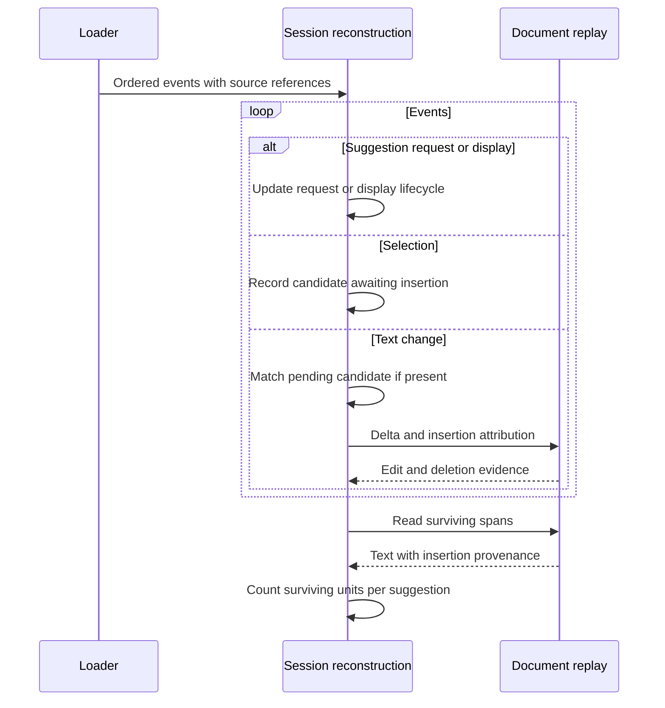

# Architecture

The package separates source loading from reconstruction. Scientific interpretation will consume reconstructed evidence through explicit indicator definitions in the next stage.

`ingestion/coauthor.py` validates input, preserves source records and checks sequence continuity. Events are ordered by `eventNum`; decreasing timestamps generate an issue rather than changing edit order. Conflicting duplicates and missing event numbers stop reconstruction. Identical duplicates are collapsed and reported.

`reconstruction/document.py` applies plain-text Delta operations and carries insertion provenance through retention and deletion. It uses UTF-16 units so JavaScript offsets remain valid for emoji and other supplementary characters. Invalid operations fail before changing the document. Formatting is recognized but not rendered; embedded media are unsupported.

`reconstruction/session.py` tracks requests separately from displayed suggestion sets and confirms candidate text against API insertions. It returns the final document, attributed spans, edits, request records, display interaction records and issues. UI lifecycles are not assigned pedagogical episode labels.

`model.py` defines the typed records shared by these modules. `cli.py` provides the `reconstruct` command. The public Python API is `load_session` followed by `reconstruct`.

The CLI processes files sequentially to keep memory bounded by one session. Plain-text replay currently uses a list of UTF-16 units, so each edit may copy the document. This is suitable for the supplied writing session; full-corpus runtime has not been benchmarked. API calls return source event records and can therefore contain participant writing text.
