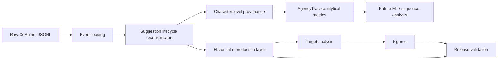

# AgencyTrace

**Trace reconstruction, provenance, behavioral measurement, and reproducible analysis of human–AI co-writing interactions.**

AgencyTrace accompanies the manuscript **“Who Acts, Who Decides, Who Regulates? Making Human–AI Agency Observable through Learning Analytics.”** It transforms temporally ordered CoAuthor interaction logs into auditable evidence about AI consultation, response use, text provenance, and reliance dynamics.

The repository is designed around one principle: **do not infer more than the trace supports**. Observable events are reconstructed first; provenance and behavioral measures are derived second; theoretical interpretation comes afterward.

> **Current release:** `v0.1.1`
> **Python:** `>=3.11`
> **Validated corpus:** 1,447 CoAuthor sessions

---

## Why AgencyTrace?

Human–AI writing logs are not immediately analytical data. A raw event such as `suggestion-select`, `text-insert`, or `text-delete` does not by itself establish adoption, modification, rejection, or learner agency.

AgencyTrace therefore separates the pipeline into explicit layers:



This separation is intentional. The AgencyTrace analytical methodology is not silently replaced by the simpler historical rules required to reproduce earlier reference analyses.

---

## Verified corpus snapshot

The current release has been executed on the complete local CoAuthor corpus:

| Quantity | Verified value |
|---|---:|
| Sessions | 1,447 |
| Raw events | 2,701,458 |
| `suggestion-get` | 18,103 |
| `suggestion-open` | 17,012 |
| `suggestion-reopen` | 45 |
| `suggestion-select` | 12,812 |
| `suggestion-close` | 16,967 |
| Reconstructed suggestion episodes | 18,103 |
| Reconstructed selections | 12,812 |
| Dismissed episodes | 4,088 |

The lifecycle audit preserves all 18,103 requests and all 12,812 selections without fabricating missing episodes. Of 45 reopen events, 42 are attributable to an observable prior episode and 3 remain explicit orphan-reopen anomalies.

---

## Character-level provenance

AgencyTrace replays Quill deltas and tracks the causal origin of surviving text.

For the validated corpus:

| Provenance quantity | Value |
|---|---:|
| AI characters inserted | 858,779 |
| AI characters surviving | 801,131 |
| AI characters deleted | 57,648 |
| Final textual characters | 3,359,765 |
| Final AI-origin characters | 801,131 |
| Final human-origin characters | 2,094,218 |
| Final initialization/system characters | 464,416 |
| Corpus AI retention ratio | 0.9329 |

No later `currentDoc` snapshot exists in the corpus, so final reconstructed documents cannot be externally checked against an independent final-document snapshot. This limitation is reported rather than hidden.

---

## AgencyTrace analytical outcomes

The AgencyTrace analytical layer classifies confirmed AI insertions using causal provenance:

- **Direct Adoption** — all inserted AI characters survive and remain contiguous without foreign-origin interruption.
- **Modified Adoption** — some AI text survives, but the inserted span is partially deleted or interrupted.
- **Non-Adoption** — no inserted AI-origin characters survive.

Validated totals:

| Outcome | Count | Share |
|---|---:|---:|
| Direct Adoption | 7,833 | 61.14% |
| Modified Adoption | 4,754 | 37.11% |
| Non-Adoption | 225 | 1.76% |
| **Total selections** | **12,812** | **100%** |

The AgencyTrace authored-text AI share excludes initialization/system text and is computed over final AI-origin plus final human-origin characters.

See [Metrics](docs/metrics.md) and [Provenance](docs/provenance.md).

---

## Historical reproduction layer

AgencyTrace also contains a deliberately separate compatibility layer used to reproduce the established reference analysis.

Its five request outcomes reproduce exactly:

| Historical outcome | Count |
|---|---:|
| `accept_unchanged` | 12,427 |
| `accepted_modified` | 364 |
| `non_adoption` | 3,205 |
| `presented_no_selection` | 878 |
| `request_without_suggestion` | 1,229 |
| **Total requests** | **18,103** |

The historical 10 × 10 Spearman matrix is also numerically reproduced exactly against the recovered reference matrix.

The stacked-response figure is therefore an exact **numeric** reproduction of the historical outcome composition. Its visual styling follows the recovered reference vocabulary but is not claimed to be source-identical.

---

## Installation

Create and activate a virtual environment, then install AgencyTrace in editable mode:

```bash
python -m venv .venv
```

Windows PowerShell:

```powershell
.\.venv\Scripts\Activate.ps1
python -m pip install -e ".[dev]"
```

Linux/macOS:

```bash
source .venv/bin/activate
python -m pip install -e ".[dev]"
```

Runtime dependencies are currently NumPy and Matplotlib. Pytest is included in the development dependency set.

---

## Quick start

Check the CLI:

```bash
agencytrace --version
agencytrace --help
```

Reconstruct the full corpus:

```bash
agencytrace reconstruct data/raw --summary
```

Run release validation:

```bash
agencytrace validate
```

Run the complete reproducibility workflow:

```bash
agencytrace reproduce
```

For a faster rerun after corpus audits have already been verified:

```bash
agencytrace reproduce --skip-audits
```

---

## CLI

AgencyTrace exposes seven public commands:

```text
agencytrace reconstruct
agencytrace audit
agencytrace export
agencytrace analyze
agencytrace figures
agencytrace reproduce
agencytrace validate
```

Examples:

```bash
agencytrace audit lifecycle
agencytrace export modern
agencytrace export target
agencytrace analyze
agencytrace figures
```

See [Command-Line Interface](docs/cli.md).

---

## Reproducibility pipeline

The full pipeline is:

```text
data/raw/*.jsonl
        │
        ├── text-delta audit
        ├── lifecycle audit
        ├── provenance audit
        │
        ├── AgencyTrace metric export
        ├── metric audit
        │
        ├── historical target export
        ├── target analysis
        ├── figure generation
        │
        └── release validation
```

The final validator checks frozen corpus counts, AgencyTrace metric exports, historical outcome reproduction, the target correlation matrix, AI-share group composition, and required figure outputs.

See [Reproducibility](docs/reproducibility.md) and [Verification](docs/verification.md).

---

## Generated outputs

AgencyTrace analytical metrics:

```text
data/processed/session_metrics.csv
data/processed/selection_metrics.csv
```

Historical reproduction outputs:

```text
data/processed/target_behavior_metrics.csv
data/processed/request_outcomes.csv
```

Analysis outputs:

```text
data/analysis/target_behavior_correlations.csv
data/analysis/target_behavior_sample_sizes.csv
data/analysis/target_outcomes_by_ai_share.csv
```

Validated figures:

```text
figures/ai_share_response_outcomes.png
figures/ai_share_response_outcomes.pdf
figures/trace_indicator_correlations.png
figures/trace_indicator_correlations.pdf
```

Generated `data/processed/`, `data/analysis/`, and `outputs/` directories are reproducible artifacts and are excluded from normal source tracking.

---

## Repository structure

```text
AgencyTrace/
├── data/
│   ├── raw/                 # CoAuthor JSONL corpus (Git LFS)
│   ├── processed/           # regenerated metrics
│   └── analysis/            # regenerated analysis tables
├── docs/                    # scientific and technical documentation
├── figures/                 # publication-oriented figure outputs
├── scripts/
│   ├── audit_*.py           # corpus and metric audits
│   ├── export_metrics.py
│   ├── export_target_behavior.py
│   ├── reproduce_all.py
│   └── validate_release.py
├── src/agencytrace/
│   ├── io.py
│   ├── models.py
│   ├── reconstruct.py
│   ├── provenance.py
│   ├── metrics.py
│   ├── behavior.py
│   ├── analysis.py
│   ├── figures.py
│   └── cli.py
├── tests/
├── pyproject.toml
└── README.md
```

---

## Scientific boundaries

AgencyTrace distinguishes **observed behavior** from **interpretation**.

Selection does not automatically mean trust. Editing does not automatically mean verification. Dismissal does not automatically establish epistemic rejection. Repeated consultation does not by itself establish dependency. Character persistence is not equivalent to conceptual acceptance.

The current release reconstructs and measures observable interaction behavior. Constructs such as critical thinking, decision authority, monitoring, regulation, or learner agency require explicit operational definitions and supporting evidence before they are inferred.

This principle will remain central in the upcoming ML layer: models will be trained on defensible trace features, not on labels invented from unsupported assumptions.

---

## Documentation

- [Architecture](docs/architecture.md) — system modules and data flow.
- [Data model](docs/data_model.md) — core analytical objects.
- [Methodology](docs/methodology.md) — scientific assumptions and boundaries.
- [Reconstruction](docs/reconstruction.md) — suggestion lifecycle semantics.
- [Provenance](docs/provenance.md) — causal text-origin reconstruction.
- [Metrics](docs/metrics.md) — AgencyTrace and historical metrics.
- [CLI](docs/cli.md) — command reference.
- [Reproducibility](docs/reproducibility.md) — end-to-end reproduction.
- [Verification](docs/verification.md) — frozen validation results.
- [Roadmap](docs/roadmap.md) — planned ML and interactive-tool layers.
- [Data](data/README.md) — corpus and generated-data policy.

---

## Roadmap

The validated reconstruction/reproduction foundation is complete. The next development stages are:

1. defensible session- and episode-level feature engineering;
2. descriptive and distributional analysis;
3. clustering and representation analysis;
4. sequence and transition modeling;
5. predictive modeling with leakage-safe evaluation;
6. robustness and sensitivity analysis;
7. publication-grade ML figures and tables;
8. an interactive AgencyTrace analysis tool built on the validated analytical core.

See [Roadmap](docs/roadmap.md).

---

## Testing

Run:

```bash
pytest -q
```

The current public suite validates core loading/reconstruction behavior and the CLI. Corpus-level scientific invariants are additionally checked by the audit and release-validation scripts.

---

## Data attribution

The interaction corpus originates from the Stanford CoAuthor project by Mina Lee, Percy Liang, and Qian Yang.

AgencyTrace does not alter upstream dataset ownership or licensing. Before redistributing raw CoAuthor data, users should verify that their use and redistribution comply with the upstream dataset terms.

---
