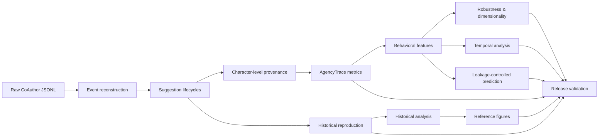
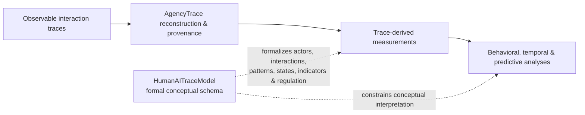

# AgencyTrace

**Trace reconstruction, provenance, behavioral measurement, and reproducible analysis of human–AI co-writing interactions.**

AgencyTrace accompanies the manuscript **“Who Acts, Who Decides, Who Regulates? Making Human–AI Agency Observable through Learning Analytics.”** It transforms temporally ordered CoAuthor interaction logs into auditable evidence about AI consultation, response use, text provenance, and reliance dynamics.

The repository follows one central principle:

> **Do not infer more than the trace supports.**

Observable interaction events are reconstructed first, behavioral and provenance measures are derived second, and theoretical interpretation is introduced only where supported by the evidence.

> **Release:** `v0.1.1`  
> **Python:** `>=3.11`  
> **Validated corpus:** 1,447 CoAuthor sessions  
> **Test suite:** 68 tests

---

## Overview

Raw interaction logs do not directly reveal adoption, modification, rejection, reliance, or learner agency. AgencyTrace therefore separates reconstruction, measurement, historical reproduction, and analytical modeling into explicit layers.



The historical reproduction layer is intentionally separate from the AgencyTrace analytical methodology. Historical compatibility rules are never silently substituted for the provenance-based analytical definitions.

---

## HumanAITraceModel

AgencyTrace also includes **HumanAITraceModel**, a formal EMF/Ecore metamodel that accompanies the empirical analysis layer. The metamodel provides an explicit conceptual vocabulary for representing human–AI learning interactions without treating the Python implementation itself as the conceptual model.

HumanAITraceModel organizes concepts including:

- human and AI actors (`HumanActor`, `AIAgent`, `Teacher`, `Learner`);
- learning scenarios and activities (`LearningScenario`, `LearningActivity`);
- interaction structure (`InteractionTask`, `InteractionSequence`, `Stimulus`, `Action`);
- AI-use and reliance constructs (`AIUsagePattern`, `Trigger`, `RelianceState`);
- Learning Analytics evidence (`EvidenceNarration`, `LearningIndicator`, `LearningSignal`);
- agency and regulation (`Agency`, `RegulatoryConfiguration`);
- analytical and visual representations (`InteractionAnalysis`, `VisualAnalytics`, `VisualizationGoal`).



The two artifacts have complementary roles: **AgencyTrace operationalizes and analyzes observable evidence; HumanAITraceModel formalizes the conceptual entities and relations used to reason about that evidence.** The metamodel is not an alternative event parser and is not required to execute the Python reproduction pipeline.

Model resources are located in:

```text
HumanAITraceModel/model/HumanAITraceModel.ecore
HumanAITraceModel/model/HumanAITraceModel.genmodel
HumanAITraceModel/model/HumanAITraceModel.aird
```

---

## Verified corpus

The validated corpus contains:

| Quantity | Value |
|---|---:|
| Sessions | 1,447 |
| Raw events | 2,701,458 |
| Suggestion requests | 18,103 |
| Suggestion opens | 17,012 |
| Suggestion reopens | 45 |
| Suggestion selections | 12,812 |
| Suggestion closes | 16,967 |
| Reconstructed suggestion episodes | 18,103 |
| Reconstructed selections | 12,812 |
| Dismissed episodes | 4,088 |

All 18,103 observable requests and all 12,812 selections are preserved. Of the 45 reopen events, 42 are attributable to an observable prior episode and 3 remain explicit orphan-reopen anomalies.

---

## Character-level provenance

AgencyTrace replays Quill deltas and tracks the causal origin of surviving text.

| Provenance quantity | Value |
|---|---:|
| AI characters inserted | 858,779 |
| AI characters surviving | 801,131 |
| AI characters deleted | 57,648 |
| Final textual characters | 3,359,765 |
| Final AI-origin characters | 801,131 |
| Final human-origin characters | 2,094,218 |
| Final initialization/system characters | 464,416 |
| Corpus AI retention ratio | 0.9329 |

AI origin is established through the reconstructed selection → API insertion relation rather than text similarity.

The corpus does not contain later independent `currentDoc` snapshots, so reconstructed final documents cannot be externally compared with a separate final-document ground truth. This limitation is retained explicitly.

See [Provenance](docs/provenance.md).

---

## AgencyTrace analytical outcomes

Confirmed AI insertions are classified using final causal provenance:

- **Direct Adoption** — all inserted AI characters survive and remain contiguous without foreign-origin interruption.
- **Modified Adoption** — AI-origin text survives, but the inserted span is partially deleted or interrupted.
- **Non-Adoption** — no inserted AI-origin characters survive.

| Outcome | Count | Share |
|---|---:|---:|
| Direct Adoption | 7,833 | 61.14% |
| Modified Adoption | 4,754 | 37.11% |
| Non-Adoption | 225 | 1.76% |
| **Total** | **12,812** | **100%** |

The authored-text AI share is calculated over final AI-origin and human-origin characters and excludes initialization/system text.

See [Metrics](docs/metrics.md).

---

## Behavioral analysis

AgencyTrace derives trace-based behavioral features while preserving undefined quantities as missing rather than replacing them with arbitrary zeros.

The primary multivariate analysis uses 1,357 complete sessions, corresponding to **93.78%** of the corpus.

### Behavioral structure

Exploratory clustering produces interpretable partitions, but membership is sensitive to reasonable changes in scaling, feature specification, and clustering algorithm.

AgencyTrace therefore does **not** impose a fixed behavioral user taxonomy.

The evidence supports **continuous multidimensional behavioral variation** more strongly than stable discrete behavioral types.

PCA is retained as a descriptive and robustness analysis rather than interpreted as a fixed set of theoretical agency dimensions.

### Temporal response-use dynamics

Across the corpus:

- 11,421 consecutive selection transitions are observable;
- 11,400 occur across distinct suggestion requests;
- 1,332 sessions contain at least two selections.

The observed cross-request self-transition rate is `0.6026`, compared with a within-session permutation-null mean of `0.5963` (`p = 0.05994`).

The corpus therefore does not support a claim of broad serial persistence. Instead, it shows localized transition dependencies.

Session-weighted early-to-late analysis shows:

- Direct Adoption: `+0.0383`
- Modified Adoption: `−0.0324`
- Non-Adoption: `−0.0059`

The first two changes have bootstrap intervals excluding zero; the Non-Adoption interval includes zero. These are corpus-level tendencies rather than universal learner trajectories.

### Prospective prediction

Prediction uses only information observable **at or before AI insertion**. Final survival, deletion, final AI share, later session duration, and previous final adoption outcomes are excluded from the predictor set.

Cross-validation is grouped by session to prevent train/test session leakage.

For **Direct vs Modified Adoption**, the best discrimination obtained by histogram gradient boosting is:

- ROC-AUC: `0.6231`
- Average precision: `0.7216`
- Balanced accuracy: `0.5859`

The signal is modest but reproducible under session-cluster bootstrap inference.

For **Non-Adoption**, logistic models contain weak ranking information, but classification utility remains poor because Non-Adoption represents only 1.76% of selections. AgencyTrace therefore does not present these models as reliable individual-level rejection detectors.

---

## Historical reproduction

A separate compatibility layer reproduces the historical five-way request analysis:

| Historical outcome | Count |
|---|---:|
| `accept_unchanged` | 12,427 |
| `accepted_modified` | 364 |
| `non_adoption` | 3,205 |
| `presented_no_selection` | 878 |
| `request_without_suggestion` | 1,229 |
| **Total requests** | **18,103** |

The recovered 10 × 10 Spearman correlation matrix and AI-share outcome composition are reproduced numerically exactly.

The corresponding PNG/PDF figures belong to this historical reproduction layer.

---

## Installation

Create and activate a virtual environment.

```bash
python -m venv .venv
```

Windows PowerShell:

```powershell
.\.venv\Scripts\Activate.ps1
python -m pip install -e ".[dev,ml]"
```

Linux/macOS:

```bash
source .venv/bin/activate
python -m pip install -e ".[dev,ml]"
```

---

## Quick start

Inspect the command-line interface:

```bash
agencytrace --version
agencytrace --help
```

Reconstruct the corpus:

```bash
agencytrace reconstruct data/raw --summary
```

Run the complete reproducibility workflow:

```bash
python scripts/reproduce_all.py
```

After previously verified corpus audits, a shorter rerun is available:

```bash
python scripts/reproduce_all.py --skip-audits
```

Run release validation independently:

```bash
python scripts/validate_release.py
```

---

## CLI

AgencyTrace exposes the following public commands:

```text
agencytrace reconstruct
agencytrace audit
agencytrace export
agencytrace analyze
agencytrace figures
agencytrace reproduce
agencytrace validate
```

See [Command-Line Interface](docs/cli.md).

---

## Reproducibility

The end-to-end workflow covers:

```text
Raw CoAuthor JSONL
        │
        ├── text-delta audit
        ├── lifecycle reconstruction audit
        ├── provenance audit
        │
        ├── AgencyTrace metric export
        ├── metric audit
        │
        ├── historical reproduction
        ├── historical analysis
        ├── historical figure reproduction
        │
        ├── behavioral feature export
        ├── feature audit and diagnostics
        ├── exploratory clustering
        ├── clustering robustness and sensitivity
        ├── dimensionality robustness
        ├── temporal response-use analysis
        ├── leakage-controlled prediction
        ├── session-cluster inference
        │
        ├── full test suite
        └── release validation
```

A validated full run completes with:

```text
AgencyTrace release validation PASSED.
AgencyTrace reproduction completed successfully.
```

See [Reproducibility](docs/reproducibility.md) and [Verification](docs/verification.md).

---

## Generated outputs

Core analytical tables:

```text
data/processed/session_metrics.csv
data/processed/selection_metrics.csv
data/processed/ml_session_features.csv
```

Historical reproduction:

```text
data/processed/target_behavior_metrics.csv
data/processed/request_outcomes.csv
data/analysis/target_behavior_correlations.csv
data/analysis/target_behavior_sample_sizes.csv
data/analysis/target_outcomes_by_ai_share.csv
```

Behavioral analyses:

```text
data/analysis/ml/clustering/
data/analysis/ml/dimensionality/
data/analysis/ml/transitions/
data/analysis/ml/prediction/
```

Historical reproduction figures:

```text
figures/ai_share_response_outcomes.png
figures/ai_share_response_outcomes.pdf
figures/trace_indicator_correlations.png
figures/trace_indicator_correlations.pdf
```

Generated `data/processed/`, `data/analysis/`, and `outputs/` artifacts are excluded from normal source tracking and can be regenerated from the raw corpus.

---

## Repository structure

```text
AgencyTrace/
├── data/
│   ├── raw/                  # CoAuthor corpus, Git LFS
│   ├── processed/            # regenerated analytical tables
│   └── analysis/             # regenerated analysis outputs
├── docs/
├── figures/                  # historical reproduction figures
├── HumanAITraceModel/        # EMF/Ecore conceptual metamodel
│   └── model/
│       ├── HumanAITraceModel.ecore
│       ├── HumanAITraceModel.genmodel
│       └── HumanAITraceModel.aird
├── scripts/
│   ├── audit_*.py
│   ├── export_*.py
│   ├── analyze_ml_features.py
│   ├── evaluate_ml_clusters.py
│   ├── evaluate_cluster_robustness.py
│   ├── evaluate_cluster_sensitivity.py
│   ├── evaluate_dimension_robustness.py
│   ├── analyze_selection_transitions.py
│   ├── evaluate_prediction_tasks.py
│   ├── reproduce_all.py
│   └── validate_release.py
├── src/agencytrace/
│   ├── reconstruct.py
│   ├── provenance.py
│   ├── metrics.py
│   ├── behavior.py
│   ├── analysis.py
│   ├── figures.py
│   ├── cli.py
│   └── ml/
├── tests/
├── pyproject.toml
└── README.md
```

---

## Scientific boundaries

AgencyTrace distinguishes **observable behavior** from theoretical interpretation.

Selection does not automatically imply trust. Editing does not automatically imply verification. Dismissal does not automatically establish epistemic rejection. Repeated consultation does not by itself establish dependency. Character persistence is not equivalent to conceptual acceptance.

Likewise, clustering does not establish natural learner types, principal components do not automatically constitute psychological constructs, temporal association does not establish causal regulation, and predictive importance does not establish causal influence.

Constructs such as critical thinking, decision authority, monitoring, regulation, or learner agency require explicit operational definitions and evidence beyond behavioral traces when appropriate.

---

## Testing and validation

Run the test suite with:

```bash
python -m pytest -q
```

The current validated suite contains **68 tests**.

Release validation additionally checks:

- corpus size and core event-derived counts;
- session and selection metric accounting;
- analytical adoption outcomes;
- historical five-way reproduction;
- historical correlation and AI-share outputs;
- required historical figure artifacts;
- behavioral feature outputs;
- clustering and dimensionality artifacts;
- exact cross-request transition accounting;
- session-weighted temporal direction checks;
- prediction feature leakage guards;
- grouped-CV session isolation;
- prediction output structure and baseline comparisons.

---

## Documentation

- [Architecture](docs/architecture.md) — analytical architecture and data flow.
- [Data model](docs/data_model.md) — units of observation, evidence, and analysis.
- [Methodology](docs/methodology.md) — operationalization strategy, assumptions, and inference boundaries.
- [Reconstruction](docs/reconstruction.md) — suggestion lifecycle reconstruction.
- [Provenance](docs/provenance.md) — causal character-origin reconstruction.
- [Metrics](docs/metrics.md) — analytical and historical measures.
- [CLI](docs/cli.md) — command reference.
- [Reproducibility](docs/reproducibility.md) — complete reproduction workflow.
- [Verification](docs/verification.md) — frozen validity and verification protocol.
- [Data](data/README.md) — corpus and generated-data policy.
- `HumanAITraceModel/` — formal EMF/Ecore metamodel accompanying the trace-analysis methodology.

---

## Data attribution

The interaction corpus originates from the Stanford CoAuthor project by Mina Lee, Percy Liang, and Qian Yang.

AgencyTrace does not alter upstream dataset ownership or licensing. Users redistributing the raw corpus should verify that their use complies with the upstream dataset terms.

---

## Anonymous review

Author-identifying citation metadata is intentionally omitted from the review version of the repository.
