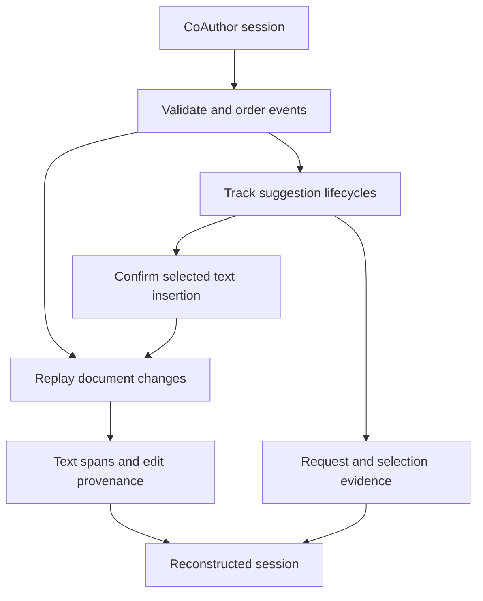

# AgencyTrace

Trace reconstruction for **Who Acts, Who Decides, Who Regulates? Making Human–AI Agency Observable through Learning Analytics**.

This first implementation stage reads CoAuthor writing logs, reconstructs document changes, and links selected suggestions to their inserted and surviving text. It preserves event provenance for the indicator and analysis layers that will follow.

## Current scope

- JSONL and JSON-array session loading with explicit sequence validation.
- Plain-text Quill Delta replay with UTF-16 positions.
- Suggestion request, display, selection, dismissal and insertion tracking.
- Surviving text attributed to initialization, writer insertion, confirmed AI insertion, API whitespace or unknown origin.
- Per-edit deletion evidence and per-suggestion surviving text counts.

This is a manuscript-based implementation. Indicator definitions, learning-episode segmentation, clustering, Markov transitions, correlation and figure generation are **not implemented in this stage**. The original Xtext system and IndiCanvas interface are separate artifacts.

## Install and run

Requires Python 3.11 or newer. The reconstruction layer has no third-party runtime dependencies.

```bash
python -m pip install -e .
python -m agencytrace reconstruct data/raw --summary
```

The command reads one session at a time and prints aggregate counts, issue totals and failed paths. Omit `--summary` to inspect individual sessions. It creates no CSV or inventory files. Add the remaining CoAuthor JSONL sessions to `data/raw/`; subdirectories are searched recursively. For session files stored as JSON arrays:

```bash
python -m agencytrace reconstruct data/raw --pattern "*.json"
```

Keep metadata files outside the selected session glob. A failed session is reported and the command continues to the next file; any failure produces a nonzero exit code. Reconstruction issues are reported for review and must be resolved before interpreting downstream measurements.

## Python API

```python
from agencytrace import load_session, reconstruct

session = load_session("data/raw/7e9c3c8fbe1f4a02bcb9940a2bf95d9f.jsonl")
trace = reconstruct(session)

print(trace.final_text)
print(trace.final_origin_counts)
# trace.spans: final text offsets and insertion provenance
# trace.edits: inserted/deleted units and deletion provenance
# trace.requests: recorded requests, including unanswered requests
# trace.interactions: displayed candidate sets with confirmed insertions
# trace.issues: evidence and compatibility problems requiring review
```

## Architecture



See [architecture](docs/architecture.md) for module responsibilities and [reconstruction](docs/reconstruction.md) for the evidence rules and limitations. Dataset notes are in [data/README.md](data/README.md). Figure outputs will reside in `results/figs/`, with generation code in `src/agencytrace/visualization/` when that stage is implemented.

Version **0.1.1** corrects refresh ordering and overlapping requests. See [verification](docs/verification.md) for the supplied-session regression results.

## Verify

```bash
python -m unittest discover -s tests -v
```

The supplied session contains 3,170 events and 2,766 text changes. Reconstruction confirms four requests, three selected insertions and one user dismissal. Its final text contains 2,445 Unicode code points. These are sample checks, not corpus findings or psychological indicators. See [verification](docs/verification.md).

## Attribution and reuse

CoAuthor data originate from the CoAuthor project by Mina Lee, Percy Liang and Qian Yang: <https://coauthor.stanford.edu/>. This package does not change dataset ownership or usage terms. The sample was supplied by the repository author; consult the upstream dataset terms before redistribution. The author must choose a code license and finalize manuscript citation metadata before public release.
