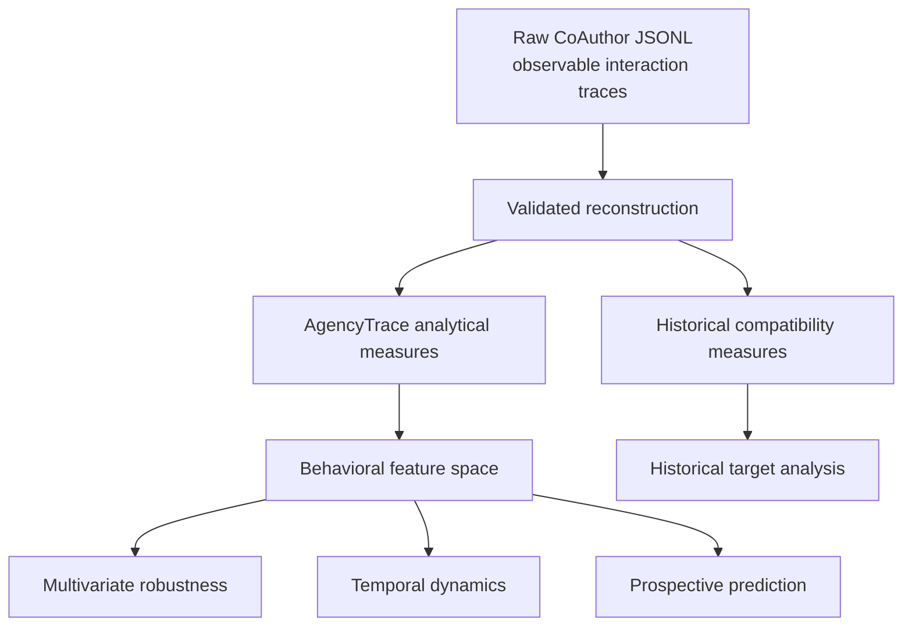
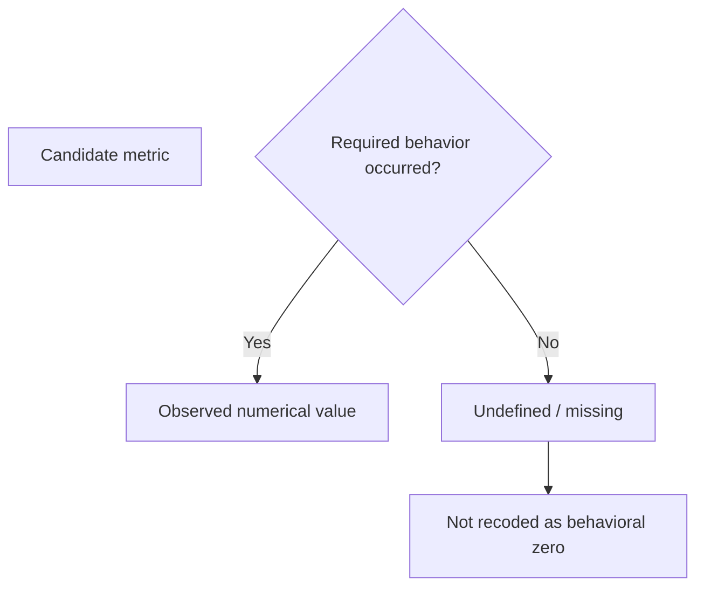
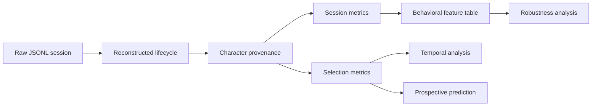

# Data Organization, Provenance, and Analytical Separation

AgencyTrace treats the CoAuthor corpus as **research evidence** rather than as an interchangeable software input. The data layout therefore distinguishes immutable source traces from reconstructed measures, historical compatibility outputs, and downstream analytical artifacts.

The central principle is:

> **Raw interaction evidence is preserved; analytical representations are regenerated from it.**

---

## How to read this document

The repository contains four conceptually distinct data layers.

| Layer | Research role | Mutability |
|---|---|---|
| Raw interaction corpus | Primary observable evidence | Immutable |
| Processed AgencyTrace measures | Reconstructed and provenance-derived behavioral observations | Regenerable |
| Historical compatibility measures | Recovered reference operationalizations | Regenerable |
| Analysis outputs | Multivariate, temporal, predictive, and historical results | Regenerable |

These layers should not be merged because they embody different evidentiary and methodological commitments.

---

## 1. Data architecture



The analytical and historical branches share a validated reconstruction foundation but use different operational definitions downstream.

---

## 2. Raw corpus

Expected location:

```text
data/raw/
```

The validated release contains:

```text
1,447 sessions
2,701,458 events
```

Each raw file represents one CoAuthor interaction session stored as JSONL.

AgencyTrace treats these files as immutable primary evidence. The reproduction workflow reads them but does not rewrite them.

Raw corpus files are tracked through **Git LFS**.

---

## 3. Observable trace semantics

The raw corpus contains temporally ordered interaction events such as:

```text
suggestion-get
suggestion-open
suggestion-reopen
suggestion-select
suggestion-close
text-insert
text-delete
suggestion-hover
```

Validated corpus counts include:

| Event | Count |
|---|---:|
| `suggestion-get` | 18,103 |
| `suggestion-open` | 17,012 |
| `suggestion-reopen` | 45 |
| `suggestion-select` | 12,812 |
| `suggestion-close` | 16,967 |
| `text-insert` | 2,306,436 |
| `text-delete` | 203,930 |
| `suggestion-hover` | 77,684 |

These records are observational. Their pedagogical interpretation is introduced only after explicit reconstruction and operationalization.

---

## 4. Session identity

The filename is used as a session identifier.

AgencyTrace does not infer learner identity, demographic attributes, task identity, or writing proficiency from the filename or text content.

A session identifier is therefore an analytical key, not a learner identifier.

---

## 5. Source preservation

AgencyTrace preserves the original event records required for reconstruction and auditability.

The reconstruction logic relies on observable fields such as:

```text
eventNum
eventTimestamp
eventName
eventSource
currentDoc
textDelta
currentSuggestions
currentHoverIndex
```

Event sequence is preserved as the primary ordering relation.

Timestamp regressions are retained as auditable anomalies rather than being silently used to rewrite event order.

---

## 6. Processed AgencyTrace measures

Generated location:

```text
data/processed/
```

Core analytical outputs:

```text
session_metrics.csv
selection_metrics.csv
ml_session_features.csv
ml_session_features_manifest.json
```

These files are derived from the validated reconstruction and causal-provenance layers.

They are **not primary data** and can be regenerated.

---

## 7. `session_metrics.csv`

This file contains one analytical record per session.

Its variables characterize observable dimensions such as:

- authored-text composition;
- AI insertion, survival, and deletion;
- consultation intensity;
- response-use composition;
- human generation before AI use;
- temporal response patterns;
- consultation burstiness;
- session duration.

The table contains:

```text
1,447 rows
```

A session-level metric should not be interpreted as a stable learner trait unless separately validated for that purpose.

---

## 8. `selection_metrics.csv`

This file contains one analytical record per confirmed AI selection.

Validated size:

```text
12,812 rows
```

It links:

```text
request
→ selection
→ API insertion
→ final provenance
→ response-use outcome
```

Selection-level response-use states are:

```text
direct_adoption
modified_adoption
non_adoption
```

These labels describe observable text-use outcomes, not learner trust or cognitive acceptance.

---

## 9. Behavioral feature dataset

`ml_session_features.csv` contains the session-level behavioral representation used for exploratory multivariate analysis.

All:

```text
1,447 sessions
```

are retained in the exported feature table.

The primary complete-case multivariate matrix contains:

```text
1,357 sessions
93.78% coverage
```

Undefined measurements remain missing rather than being replaced with arbitrary zeros.

---

## 10. Missingness semantics

AgencyTrace distinguishes **absence of behavior** from **absence of a valid denominator**.



Examples:

```text
no AI insertion
→ AI retention is undefined

no selection
→ adoption shares are undefined

no suggestion request
→ request-based rates are undefined
```

This distinction is preserved in the analytical feature layer.

---

## 11. Historical compatibility outputs

The historical reproduction layer is stored separately:

```text
data/processed/target_behavior_metrics.csv
data/processed/request_outcomes.csv
```

These files reproduce a recovered historical analytical convention.

They should not be used as inputs to the AgencyTrace ML layer.

This separation prevents historical window-based definitions from being silently substituted for provenance-based AgencyTrace measures.

---

## 12. Historical request outcomes

The historical compatibility layer uses five request-level outcomes:

```text
accept_unchanged
accepted_modified
non_adoption
presented_no_selection
request_without_suggestion
```

Validated totals:

| Historical outcome | Count |
|---|---:|
| `accept_unchanged` | 12,427 |
| `accepted_modified` | 364 |
| `non_adoption` | 3,205 |
| `presented_no_selection` | 878 |
| `request_without_suggestion` | 1,229 |
| **Total** | **18,103** |

These categories are distinct from the AgencyTrace three-way selection-level response-use model.

---

## 13. Analysis outputs

Generated location:

```text
data/analysis/
```

Historical reproduction outputs include:

```text
target_behavior_correlations.csv
target_behavior_sample_sizes.csv
target_outcomes_by_ai_share.csv
```

AgencyTrace analytical outputs are organized under:

```text
data/analysis/ml/
```

with dedicated subdirectories for:

```text
clustering/
dimensionality/
transitions/
prediction/
```

---

## 14. Multivariate analysis outputs

Clustering and dimensionality artifacts include:

```text
data/analysis/ml/clustering/
data/analysis/ml/dimensionality/
```

These outputs document:

- candidate partitions;
- cluster profiles;
- feature-drop robustness;
- scaling sensitivity;
- feature-specification sensitivity;
- algorithm agreement;
- PCA variance and loadings;
- bootstrap component stability;
- cross-scaling component and subspace agreement.

They are exploratory analytical products, not ground-truth learner labels.

---

## 15. Temporal analysis outputs

Temporal response-use outputs are written to:

```text
data/analysis/ml/transitions/
```

They include:

```text
transition_matrix.csv
transition_bootstrap.csv
session_transition_metrics.csv
positional_outcomes.csv
endpoint_matrix.csv
transition_permutation_null.csv
transition_persistence_test.csv
session_phase_shares.csv
session_weighted_phase_summary.csv
early_late_change.csv
```

These files support the distinction between overall serial persistence, localized transition dependence, and session-weighted temporal change.

---

## 16. Prediction outputs

Prospective modeling outputs are written to:

```text
data/analysis/ml/prediction/
```

They include:

```text
model_metrics.csv
oof_predictions.csv
grouped_cv_audit.csv
feature_manifest.csv
binary_task_metrics.csv
binary_task_oof_predictions.csv
binary_task_cv_audit.csv
permutation_importance_summary.csv
permutation_importance_folds.csv
logistic_coefficient_summary.csv
logistic_coefficient_folds.csv
model_improvement_bootstrap.csv
```

The prediction feature manifest explicitly records the insertion-time availability of predictors.

Grouped cross-validation audit files verify zero session overlap between training and test partitions.

---

## 17. Data lineage



This lineage allows a downstream analytical claim to be traced back to the interaction evidence from which it was derived.

---

## 18. Generated-data policy

The following directories contain regenerable artifacts:

```text
data/processed/
data/analysis/
outputs/
```

They are excluded from normal source tracking by `.gitignore`.

The raw corpus is handled separately because it is the empirical source rather than a generated analytical product.

---

## 19. Data integrity and release validation

The release validator checks, among other invariants:

```text
raw sessions                   1,447
session metric rows            1,447
selection metric rows         12,812
analytical outcome accounting  exact
historical outcome counts      exact
cross-request transitions      exact
prediction leakage guards      pass
grouped-CV session overlap     zero
```

The complete reproduction pipeline must pass before analytical outputs are treated as release-valid.

---

## 20. Attribution and upstream responsibility

The interaction corpus originates from the Stanford CoAuthor project by Mina Lee, Percy Liang, and Qian Yang.

AgencyTrace does not alter upstream dataset ownership or licensing.

Users who redistribute or reuse the raw corpus should verify that their use complies with the original CoAuthor dataset terms and documentation.

---

## 21. Data interpretation boundary

The repository stores **behavioral traces**, not direct observations of cognition.

The following distinctions remain essential:

```text
text provenance      ≠ intellectual authorship
selection            ≠ trust
dismissal            ≠ rejection
editing              ≠ verification
reconsultation       ≠ dependency
temporal transition  ≠ causal regulation
```

Data organization in AgencyTrace is therefore designed to preserve both **analytical traceability** and **epistemic restraint**.
