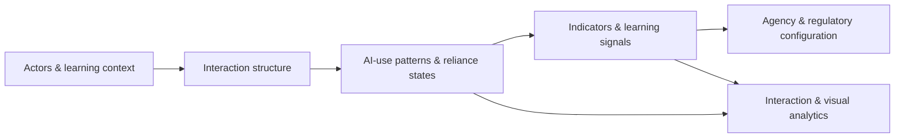
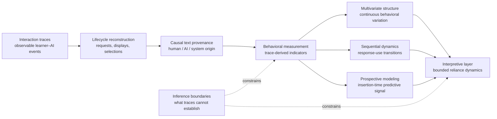
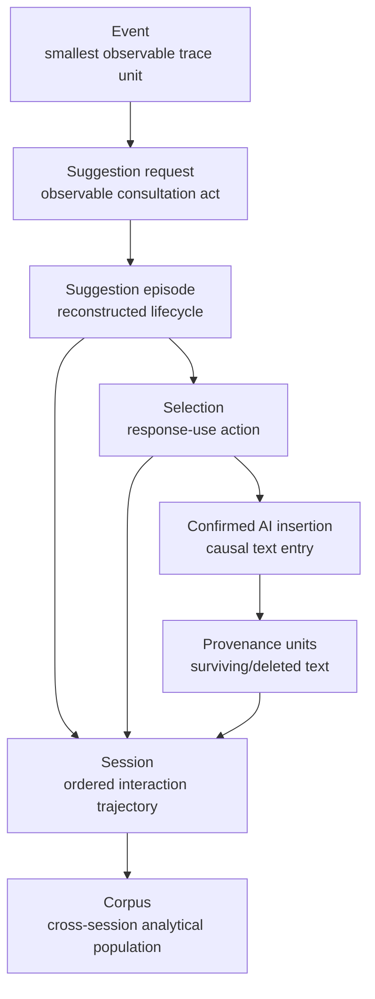
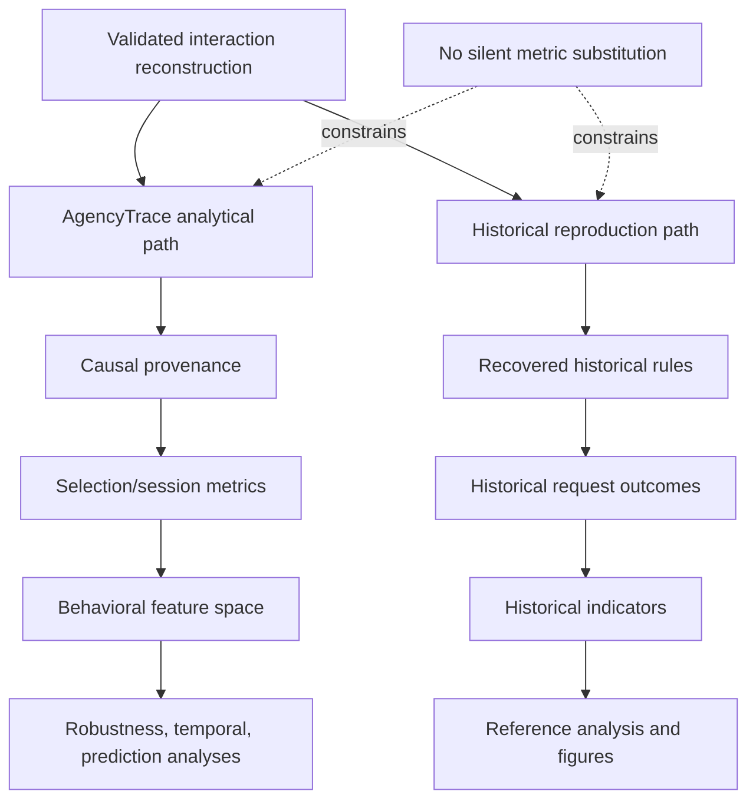
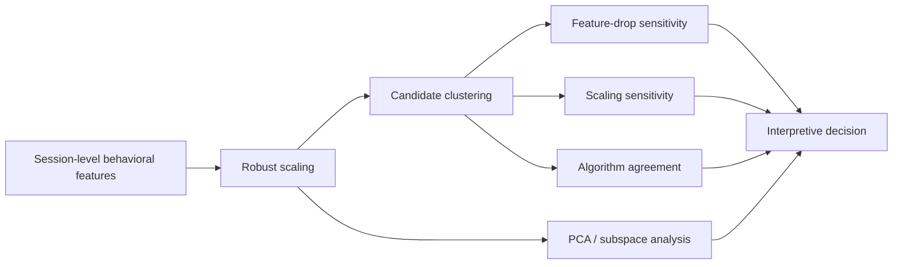
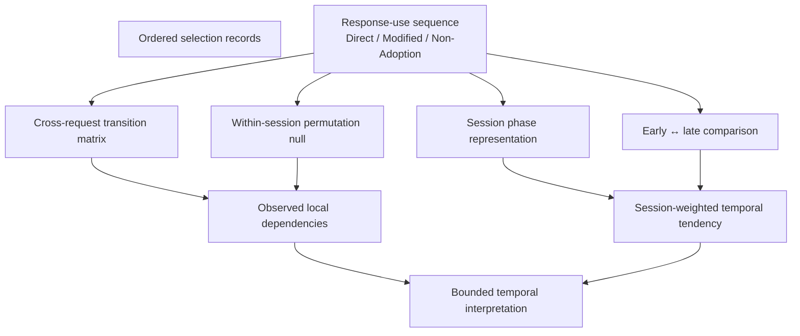
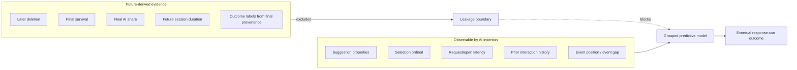
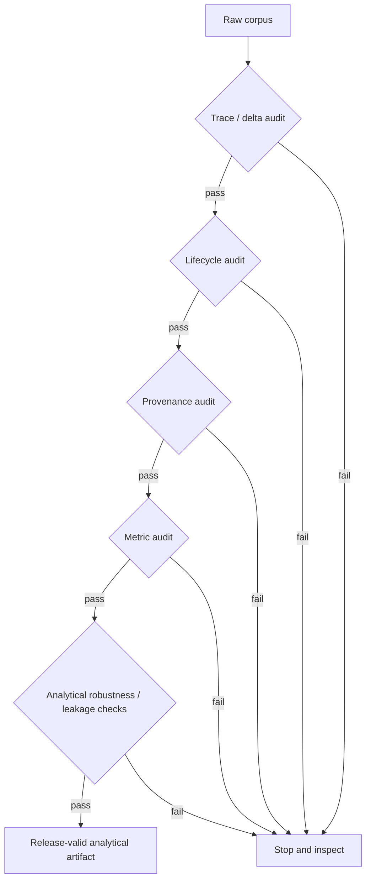

# Analytical Architecture of AgencyTrace

AgencyTrace is organized as an **evidence-to-inference architecture** for Learning Analytics research on human–AI co-writing. Its central design commitment is that every higher-level analytical claim remains traceable to observable interaction evidence and that each inferential step is explicitly bounded by what the trace can support.

The architecture therefore does not begin with learner labels, reliance categories, or predictive targets. It begins with event records and progressively constructs analytically defensible representations of consultation, response use, textual provenance, temporal dynamics, and prospective behavioral signal.

---

## How to read this document

AgencyTrace can be understood through five complementary views.

| View | Research question |
|---|---|
| Evidence pipeline | How does raw interaction evidence become an analytical indicator? |
| Unit-of-analysis hierarchy | At what level is each phenomenon observed or inferred? |
| Dual analytical paths | How are AgencyTrace measures kept distinct from historical reproduction rules? |
| Analytical inquiry layer | How are multivariate, temporal, and predictive questions posed over the same validated evidence base? |
| Validation gates | Which conditions must hold before a downstream result is considered interpretable? |
| Formal metamodel | How are actors, interactions, patterns, reliance states, indicators, signals, and regulation represented conceptually? |

No single diagram is intended to stand for the entire system. The views are deliberately orthogonal.

---

## HumanAITraceModel as the formal conceptual layer

The repository includes **HumanAITraceModel**, an EMF/Ecore metamodel that complements the empirical AgencyTrace pipeline. Whereas the Python pipeline reconstructs and measures observable interaction evidence, HumanAITraceModel makes the **conceptual structure of that evidence explicit**.

The metamodel spans six connected conceptual regions:

| Region | Representative metamodel elements |
|---|---|
| Actors and context | `Actor`, `HumanActor`, `AIAgent`, `Teacher`, `Learner`, `LearningScenario`, `LearningActivity` |
| Interaction structure | `InteractionTask`, `InteractionSequence`, `Stimulus`, `ReceiveEvent`, `Action` |
| Usage and state | `AIUsagePattern`, `Trigger`, `PatternOccurrence`, `RelianceState` |
| Learning Analytics evidence | `EvidenceNarration`, `LearningIndicator`, `LearningSignal` |
| Agency and regulation | `Agency`, `RegulatoryConfiguration`, `ControlAllocation`, `RegulationMode` |
| Analysis and representation | `InteractionAnalysis`, `AnalysisMethod`, `VisualAnalytics`, `VisualizationGoal` |

This is a **conceptual relation**, not a claim that every Ecore class maps one-to-one onto a Python runtime class or a CSV column. The implementation data model and the formal metamodel operate at different abstraction levels.

HumanAITraceModel therefore serves three architectural purposes:

1. **conceptual explicitness** — constructs used in the paper are represented as named model elements rather than remaining implicit in prose;
2. **traceability across abstraction levels** — observable interactions can be discussed in relation to patterns, states, indicators, signals, and regulatory interpretations without collapsing those levels;
3. **boundary preservation** — the metamodel provides vocabulary for interpretation, while empirical claims remain constrained by the reconstruction and measurement evidence.

The model resources are maintained under `HumanAITraceModel/model/` as `.ecore`, `.genmodel`, and `.aird` artifacts.

---

## 1. Evidence-to-inference architecture

This architecture encodes an epistemic ordering: **observation precedes operationalization, and operationalization precedes interpretation**.

---

## 2. Evidence strata

AgencyTrace distinguishes four evidence strata.

| Stratum | Empirical object | What it contributes |
|---|---|---|
| Trace evidence | Timestamped/event-ordered interaction records | Observable learner–AI actions |
| Reconstructed interaction evidence | Suggestion episodes, selections, insertion mappings | Temporal and causal interaction structure |
| Provenance evidence | Surviving/deleted character origins | Observable human–AI textual contribution |
| Analytical evidence | Session, selection, transition, and prediction outputs | Patterns that can be statistically interrogated |

The strata are cumulative. A later layer never retroactively changes the empirical meaning of an earlier layer.

---

## 3. Unit-of-analysis hierarchy

The hierarchy matters because analytical claims change meaning when the unit changes. A selection-level outcome is not a session-level learner type, and a session-level transition tendency is not a population-wide causal mechanism.

---

## 4. Core analytical objects

The validated AgencyTrace implementation centers on a small set of objects whose meanings are methodological rather than merely programmatic.

| Object | Empirical meaning | Primary downstream use |
|---|---|---|
| Event | Observable interaction record | Trace ordering and replay |
| Suggestion episode | One request-centered support lifecycle | Consultation and dismissal analysis |
| Selection | Observable choice of an AI suggestion | Response-use analysis |
| Confirmed insertion | Selection causally mapped to AI text insertion | Provenance attribution |
| Provenance unit | Textual unit with causal origin | Retention and contribution measures |
| Session | Ordered set of interaction episodes | Behavioral profiling and temporal analysis |
| Transition | Ordered relation between response-use states | Sequential dependence analysis |
| Insertion-time feature vector | Information available no later than AI insertion | Leakage-controlled prediction |

---

## 5. Dual analytical paths

AgencyTrace deliberately maintains two post-reconstruction analytical paths.

The historical path exists to reproduce an earlier analytical convention exactly. It is not used as an implicit substitute for the provenance-based AgencyTrace methodology.

This separation is especially important for AI-share measures, response-use categories, windowed historical indicators, and missing-value behavior.

---

## 6. Analytical inquiry layer

Once the validated behavioral representation is established, AgencyTrace supports three distinct forms of inquiry.

| Inquiry | Primary question | Evidentiary status |
|---|---|---|
| Multivariate structure | Does behavior form stable discrete partitions or continuous dimensions? | Exploratory/robustness-oriented |
| Temporal dynamics | How does response use evolve within sessions, and which transitions depart from within-session composition? | Sequential descriptive/inferential |
| Prospective prediction | Does information available by insertion time contain signal about later response use? | Predictive, non-causal |

These analyses are intentionally complementary. None is treated as a privileged route to an underlying psychological construct.

---

## 7. Multivariate structure as a robustness question

AgencyTrace does not treat a visually coherent clustering solution as sufficient evidence for natural learner types. Candidate partitions are interrogated through feature, scaling, and algorithm sensitivity.

The validated result favors **continuous multidimensional behavioral variation** over a fixed discrete taxonomy.

---

## 8. Temporal-analysis architecture

The temporal layer differentiates **broad serial persistence** from **localized transition dependence**. This distinction prevents an elevated transition probability from being interpreted without considering each session's underlying response-use composition.

---

## 9. Prospective prediction and the temporal information boundary

Prediction is constrained by a strict availability rule.

This architecture makes the prediction question prospective rather than retrospective.

The resulting models test whether observable interaction history contains **predictive information**. They do not explain why a learner adopts, modifies, or removes AI-generated text.

---

## 10. Validation gates

AgencyTrace is therefore **fail-closed at the level of evidence**. A downstream analytical result is not accepted merely because a model or script executes.

---

## 11. Mapping the research architecture to the package

The implementation mirrors the analytical separation without making software modules the organizing principle of the methodology.

| Analytical responsibility | Principal implementation |
|---|---|
| Event loading and trace access | `io.py`, `models.py` |
| Suggestion lifecycle reconstruction | `reconstruct.py` |
| Character-level causal provenance | `provenance.py` |
| AgencyTrace session/selection measurement | `metrics.py` |
| Historical compatibility definitions | `behavior.py`, `analysis.py` |
| Historical reference figures | `figures.py` |
| Behavioral feature construction | `ml/features.py`, `ml/dataset.py` |
| Clustering and dimensionality inquiry | `ml/clustering.py`, `ml/dimensionality.py`, `ml/robustness.py` |
| Temporal response-use analysis | `ml/transitions.py`, `ml/temporal_inference.py` |
| Prospective prediction | `ml/prediction.py`, `ml/prediction_tasks.py`, `ml/prediction_inference.py` |
| Research orchestration | `scripts/reproduce_all.py` |
| Formal conceptual representation | `HumanAITraceModel/model/HumanAITraceModel.ecore`, `.genmodel`, `.aird` |
| Release invariants | `scripts/validate_release.py` |

This mapping is deliberately secondary to the evidence architecture: modules exist to operationalize the research design, not the reverse.

---

## 12. Architectural principles

AgencyTrace is governed by seven methodological principles.

| Principle | Consequence |
|---|---|
| Evidence conservation | Observable requests and selections are not silently dropped |
| Causal provenance | AI-origin text is attributed through insertion events rather than similarity |
| Explicit uncertainty | Orphan or ambiguous evidence remains visible rather than being repaired speculatively |
| Analytical separation | Historical reproduction rules remain isolated from AgencyTrace measures |
| Temporal discipline | Prospective models cannot access future-derived information |
| Inferential restraint | Behavioral traces are not reified as direct measures of cognition or agency |
| Formal trace semantics | HumanAITraceModel externalizes the conceptual vocabulary without replacing empirical operationalization |

Together, these principles define AgencyTrace as a **research instrument for making human–AI interaction behavior inspectable**, not as a system for assigning latent learner identities.
