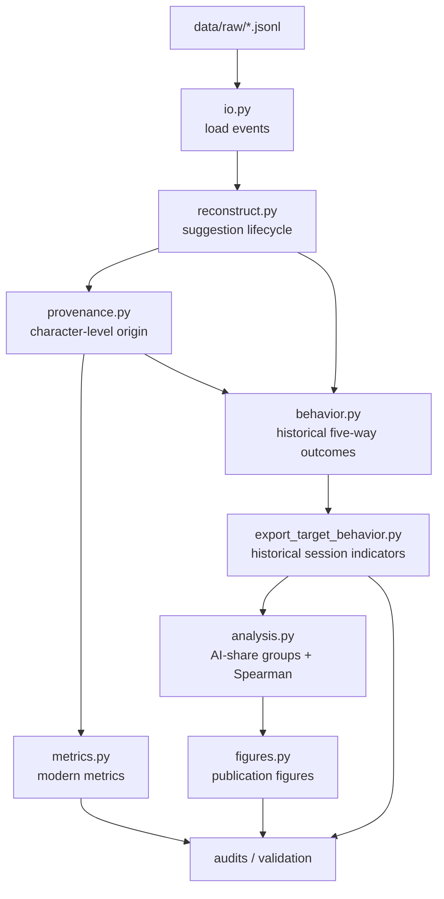

# Architecture

AgencyTrace is organized as a small scientific pipeline rather than a collection of independent scripts.

Its core design separates **trace reconstruction**, **causal text provenance**, **behavioral measurement**, **historical reproduction**, **statistical analysis**, and **visualization**.

## System overview



## Core package modules

### `io.py`

Reads CoAuthor JSONL event traces into the internal event representation.

The loader is responsible for parsing source records and exposing event fields needed by later stages. Scientific interpretation does not occur here.

### `models.py`

Defines the shared typed structures used across reconstruction, provenance, and metrics.

The model layer separates raw event observations from reconstructed suggestion episodes and derived measurements.

### `reconstruct.py`

Reconstructs suggestion lifecycles.

The central unit is one observable `suggestion-get` request. Selection and insertion events are linked to requests without fabricating missing requests or responses.

The validated corpus contains 18,103 reconstructed request episodes and 12,812 selections.

### `provenance.py`

Replays document changes and tracks causal text origin.

User text insertions receive human origin; API insertions confirmed against reconstructed selections receive AI causal origin; initial document content receives initialization/system origin. Deletion updates the surviving-origin representation.

### `metrics.py`

Computes modern AgencyTrace session- and selection-level measures from the validated reconstruction/provenance layer.

This module contains the modern adoption semantics and should not be confused with the historical reproduction layer.

### `behavior.py`

Implements the five-way request-outcome classifier used to reproduce the historical response-composition analysis.

It is intentionally separate from the modern provenance-based adoption classification.

### `analysis.py`

Builds the validated historical target analysis:

- AI-contribution tertiles;
- request-outcome composition by tertile;
- the 10 × 10 Spearman correlation matrix;
- pairwise sample-size matrix.

### `figures.py`

Generates the validated publication-oriented figures from `data/analysis/`.

It does not recompute metrics internally.

### `cli.py`

Provides the public `agencytrace` command and delegates work to the validated modules/scripts.

The CLI is deliberately thin so command-line behavior does not duplicate scientific logic.

## Script layer

The `scripts/` directory contains reproducibility and validation entry points:

```text
audit_text_deltas.py
audit_suggestion_episodes.py
audit_provenance.py
audit_metrics.py
export_metrics.py
export_target_behavior.py
reproduce_all.py
validate_release.py
```

Audits fail when core invariants are violated.

`reproduce_all.py` orchestrates the complete pipeline.

`validate_release.py` checks frozen corpus and historical-reference invariants.

## Data-flow boundaries

AgencyTrace maintains two analytical paths after reconstruction.

### Modern path

```text
events
  → lifecycle reconstruction
  → causal character provenance
  → modern selection/session metrics
```

This path is the methodological base for future ML work.

### Historical reproduction path

```text
events
  → request-window compatibility logic
  → historical indicators/outcomes
  → target analysis
  → reference figures
```

This path exists to reproduce earlier analytical definitions exactly. It is not treated as the preferred modern methodology.

## Execution model

Corpus processing is session-oriented. Each raw file can be parsed and reconstructed independently, which keeps the scientific unit of processing explicit and makes later parallelization possible.

The current public implementation favors transparent, inspectable logic over premature optimization.

## Design principles

1. **Fail visibly.** Invalid or ambiguous evidence should not be silently coerced into a plausible value.
2. **Preserve causal provenance.** AI-origin text is attributed through reconstructed insertion events, not text similarity.
3. **Separate observation from interpretation.**
4. **Keep reproduction compatibility isolated from modern methodology.**
5. **Make every publication output regenerable from code.**
