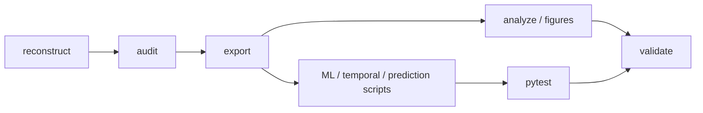

# Command-Line Interface for Reproducible Research

The AgencyTrace command-line interface exposes the validated research workflow without requiring direct use of the Python API.

The CLI is organized around **research tasks**: reconstructing evidence, auditing scientific invariants, exporting measures, reproducing analyses, generating the historical reference figures, and validating a release.

---

## How to read this document

| Research task | Public command |
|---|---|
| Inspect package/version | `agencytrace --version`, `agencytrace --help` |
| Reconstruct interaction traces | `agencytrace reconstruct` |
| Audit corpus invariants | `agencytrace audit` |
| Export processed measures | `agencytrace export` |
| Run historical analysis | `agencytrace analyze` |
| Reproduce historical figures | `agencytrace figures` |
| Execute the complete research workflow | `agencytrace reproduce` |
| Validate release invariants | `agencytrace validate` |

For the final validated end-to-end workflow, the direct script entry point is also:

```bash
python scripts/reproduce_all.py
```

---

## 1. Inspect the CLI

```bash
agencytrace --version
agencytrace --help
```

Validated release:

```text
agencytrace 0.1.1
```

---

## 2. Reconstruct the CoAuthor corpus

```bash
agencytrace reconstruct data/raw --summary
```

The reconstruction command traverses the raw corpus and reports session-level and corpus-level lifecycle results.

The validated full-corpus summary includes:

```text
Sessions                1,447
Events                  2,701,458
Suggestion requests     18,103
Suggestion selections   12,812
Dismissed episodes       4,088
Reopen events               45
```

### Research role

This command establishes the observable interaction structure used by all later analyses.

It should be run before interpreting downstream metrics when working with a new or modified corpus.

---

## 3. Audit the evidence chain

The audit interface exposes corpus-level scientific checks.

Examples include:

```bash
agencytrace audit lifecycle
```

The underlying audit scripts additionally verify:

```text
text-delta semantics
suggestion lifecycle conservation
selection identity
selection–insertion mapping
character-level provenance
analytical metric accounting
behavioral feature validity
```

Audits are different from ordinary software tests: they evaluate invariants over the empirical corpus.

---

## 4. Export AgencyTrace analytical measures

The public export interface produces the processed analytical tables.

The current CLI retains the literal subcommand:

```bash
agencytrace export modern
```

Despite the subcommand token, the resulting files are referred to throughout the documentation as **AgencyTrace analytical metrics**:

```text
data/processed/session_metrics.csv
data/processed/selection_metrics.csv
```

This naming distinction keeps reviewer-facing terminology aligned with the research methodology while preserving the existing CLI contract.

---

## 5. Export historical compatibility measures

```bash
agencytrace export target
```

This regenerates the historical reproduction tables:

```text
data/processed/target_behavior_metrics.csv
data/processed/request_outcomes.csv
```

These files implement the recovered historical definitions and are intentionally separate from the AgencyTrace provenance-based measures.

---

## 6. Run the historical target analysis

```bash
agencytrace analyze
```

This produces the recovered historical analytical tables, including:

```text
data/analysis/target_behavior_correlations.csv
data/analysis/target_behavior_sample_sizes.csv
data/analysis/target_outcomes_by_ai_share.csv
```

The command belongs to the historical reproduction path.

It should not be used as a substitute for the newer multivariate, temporal, or prospective analyses in `data/analysis/ml/`.

---

## 7. Reproduce the historical figures

```bash
agencytrace figures
```

Validated outputs:

```text
figures/ai_share_response_outcomes.png
figures/ai_share_response_outcomes.pdf
figures/trace_indicator_correlations.png
figures/trace_indicator_correlations.pdf
```

No additional figures are required by the final AgencyTrace analytical workflow.

---

## 8. Execute the complete research workflow

Preferred direct command:

```bash
python scripts/reproduce_all.py
```

Equivalent public orchestration:

```bash
agencytrace reproduce
```

The full workflow executes:

```text
trace audits
→ analytical metric export
→ historical reproduction
→ behavioral feature construction
→ clustering and robustness
→ dimensionality robustness
→ temporal response-use analysis
→ leakage-controlled prediction
→ full test suite
→ release validation
```

A validated run ends with:

```text
AgencyTrace release validation PASSED.
AgencyTrace reproduction completed successfully.
```

---

## 9. Skip previously verified audits

For a rerun after corpus integrity has already been established:

```bash
python scripts/reproduce_all.py --skip-audits
```

or, where exposed through the CLI:

```bash
agencytrace reproduce --skip-audits
```

This mode is useful during iteration but should not replace a full audited run before a research release.

---

## 10. Validate a release

```bash
agencytrace validate
```

Equivalent direct script:

```bash
python scripts/validate_release.py
```

The validator checks the frozen scientific invariants of the release.

These include:

```text
raw corpus size
session and selection accounting
provenance-based adoption outcomes
historical five-way reproduction
historical correlation reproduction
historical figure artifacts
behavioral feature outputs
clustering / dimensionality artifacts
cross-request transition accounting
session-weighted temporal directions
prediction leakage guards
grouped-CV session isolation
prediction output structure
baseline comparisons
```

---

## 11. Run the software test suite

```bash
python -m pytest -q
```

Validated state:

```text
68 passed
```

Tests and release validation serve different purposes:

| Mechanism | Primary concern |
|---|---|
| `pytest` | Reusable implementation behavior |
| corpus audits | Empirical reconstruction and accounting invariants |
| release validator | Frozen end-to-end analytical state |

---

## 12. Research workflow map



For publication or artifact review, `reproduce` is preferred because it orchestrates the full sequence rather than relying on manual invocation.

---

## 13. Direct analytical scripts

The consolidated research runners include:

```text
scripts/analyze_ml_features.py
scripts/prepare_ml_matrix.py
scripts/evaluate_ml_clusters.py
scripts/profile_ml_clusters.py
scripts/evaluate_cluster_robustness.py
scripts/evaluate_cluster_sensitivity.py
scripts/evaluate_dimension_robustness.py
scripts/analyze_selection_transitions.py
scripts/evaluate_prediction_tasks.py
scripts/reproduce_all.py
scripts/validate_release.py
```

The temporal analysis has one consolidated runner:

```text
scripts/analyze_selection_transitions.py
```

The prediction analysis has one consolidated runner:

```text
scripts/evaluate_prediction_tasks.py
```

These scripts generate analysis artifacts; they do not modify the raw corpus.

---

## 14. Recommended release sequence

```bash
python -m pytest -q
python scripts/reproduce_all.py
python scripts/validate_release.py
git diff --check
git status
```

A release should not proceed if any scientific audit, test, or release-validation gate fails.

---

## 15. Interpretive caution

The CLI executes analytical operations. It does not change their epistemic status.

Running:

```text
clustering
prediction
transition analysis
```

does not itself establish:

```text
learner types
causal mechanisms
trust
agency
learning gains
self-regulation
```

Those claims remain constrained by the methodology documented elsewhere in AgencyTrace.
