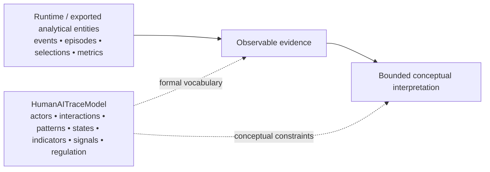
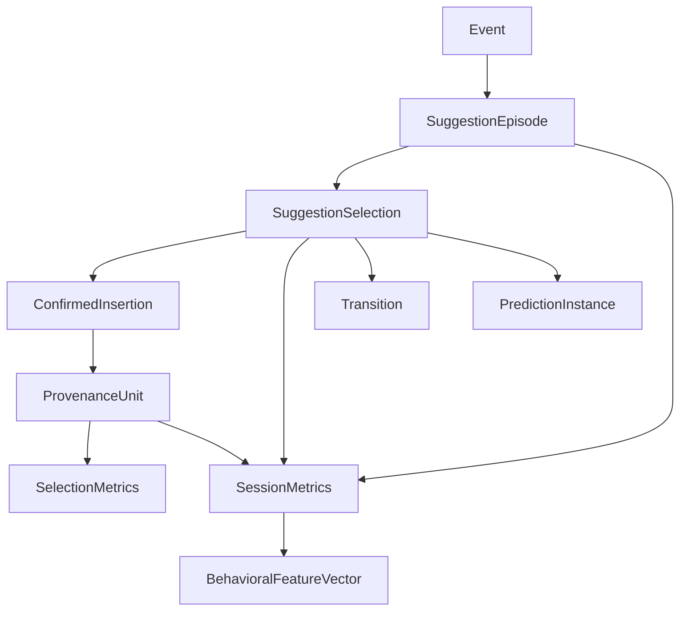
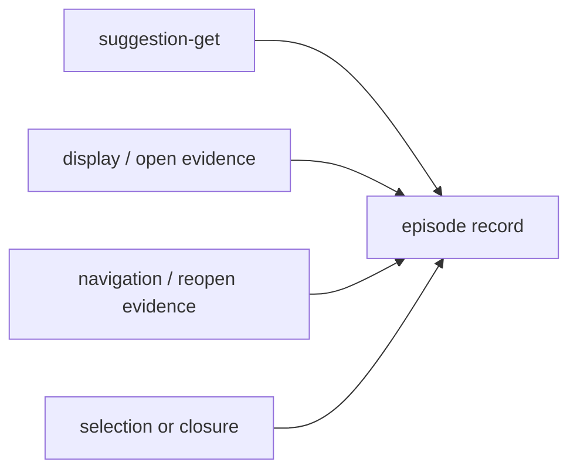
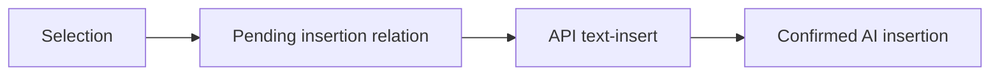
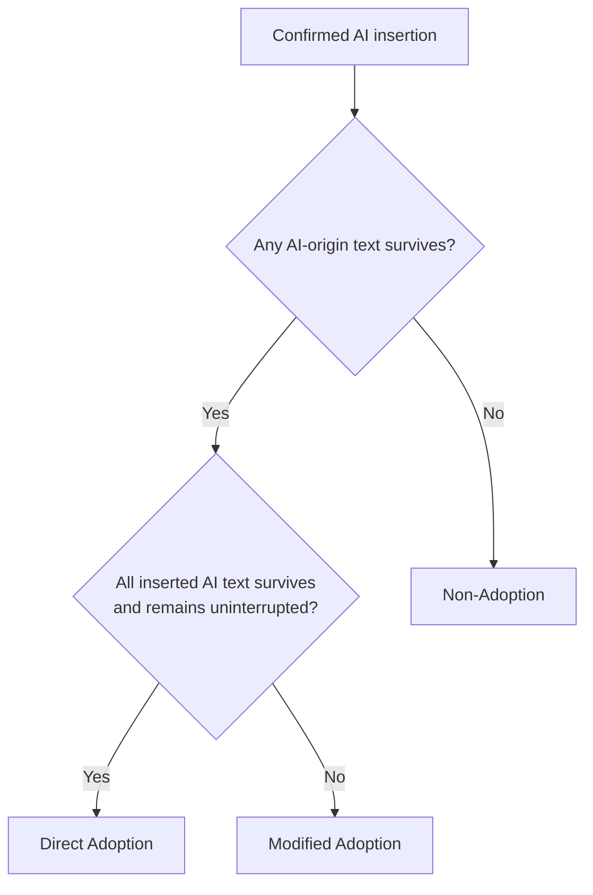
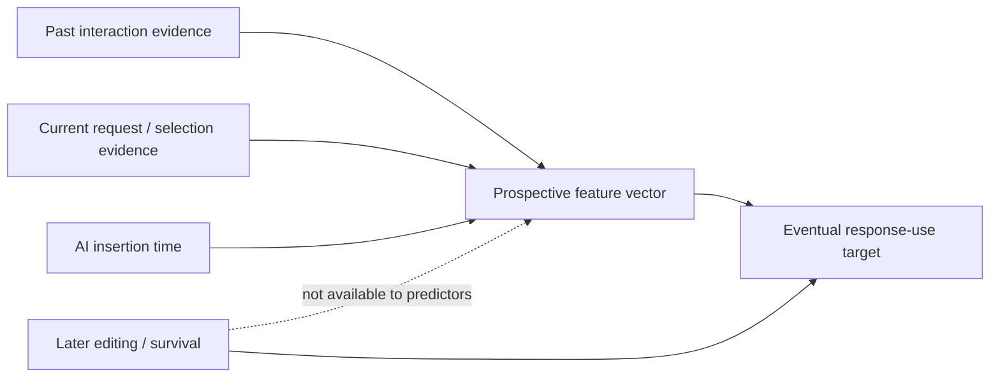

# Units of Observation, Evidence, and Analysis

AgencyTrace uses a layered data model in which each object corresponds to a distinct **unit of observation, reconstruction, measurement, or inference**.

The purpose of the model is not merely to structure software records. It is to preserve the epistemic status of the evidence as raw interaction traces are transformed into Learning Analytics indicators.

---

## How to read this document

The model distinguishes four kinds of entities.

| Entity family | Role |
|---|---|
| Observational entities | Preserve what was directly recorded in the interaction trace |
| Reconstructed entities | Encode relations recoverable from event order and lifecycle evidence |
| Measurement entities | Summarize trace/provenance evidence into explicit indicators |
| Analytical entities | Support cross-session, temporal, robustness, and predictive analyses |

A reconstructed entity is never treated as if it were directly observed, and an analytical entity is never treated as if it were a psychological construct.

---

## HumanAITraceModel and the analytical data model

AgencyTrace uses two related but non-identical forms of modeling.

The **analytical data model** documented in this file defines the concrete units manipulated by the reconstruction, provenance, measurement, temporal, and prediction pipelines. **HumanAITraceModel** is a higher-level EMF/Ecore metamodel that formalizes the conceptual vocabulary used to describe human–AI learning interactions.



Representative HumanAITraceModel elements include:

| Conceptual family | Elements |
|---|---|
| Actors | `Actor`, `HumanActor`, `AIAgent`, `Teacher`, `Learner` |
| Learning context | `LearningScenario`, `LearningActivity` |
| Interaction | `InteractionTask`, `InteractionSequence`, `Stimulus`, `Action` |
| Behavioral pattern/state | `AIUsagePattern`, `Trigger`, `RelianceState` |
| Evidence and indicators | `EvidenceNarration`, `LearningIndicator`, `LearningSignal` |
| Regulation | `Agency`, `RegulatoryConfiguration` |
| Analysis | `InteractionAnalysis`, `VisualAnalytics`, `VisualizationGoal` |

The correspondence is intentionally **conceptual rather than one-to-one**. For example, an AgencyTrace `SuggestionEpisode` is a reconstructed empirical unit, whereas HumanAITraceModel expresses more general interaction structures. Likewise, a measured response-use outcome is an operational observation; it is not automatically identical to a metamodel-level `RelianceState`.

This separation prevents implementation objects from being mistaken for theoretical constructs.

---

## 1. Analytical entity hierarchy



The arrows indicate evidentiary derivation rather than object-oriented inheritance.

---

## 2. Event

An **Event** is the smallest observable unit.

Typical evidence includes:

- event sequence number;
- timestamp;
- event name;
- event source;
- suggestion-related fields;
- document state or delta information;
- the original event record.

### Analytical status

An event supports statements about what the logging system recorded at a particular point in the interaction sequence.

It does not, by itself, establish:

- the learner's intention;
- the meaning of an action;
- the pedagogical role of the action;
- the cognitive process that produced it.

---

## 3. Suggestion episode

A **SuggestionEpisode** is the reconstructed lifecycle associated with one observable `suggestion-get`.



One request creates one episode, even when the response lifecycle is incomplete.

### Cardinality

```text
1 suggestion-get  →  1 SuggestionEpisode
1 SuggestionEpisode  →  0..n selections
```

The second relation is important because 19 validated episodes contain more than one selection.

---

## 4. Suggestion selection

A **SuggestionSelection** represents one observable `suggestion-select` action reconstructed within an episode.

It preserves the identity of the raw selection event and, where available, information such as:

- request identity;
- event number;
- selected candidate index;
- selection timestamp;
- associated display/open evidence;
- eventual API insertion mapping.

### Analytical role

The selection is the principal unit for provenance-based response-use analysis.

It should not be conflated with an episode, because one episode can contain several selections.

---

## 5. Confirmed AI insertion

A **ConfirmedInsertion** exists when a reconstructed selection is causally paired with the corresponding API text insertion.



This entity establishes the bridge between interaction behavior and document provenance.

Without that bridge, a later textual span cannot be classified as AI-origin merely because it resembles a displayed suggestion.

---

## 6. Provenance unit

A **ProvenanceUnit** is a document-level textual unit carrying causal-origin metadata.

Conceptual origins are:

```text
initial/system
human
AI
other/unknown
```

Retain operations preserve origin; delete operations remove both text and provenance; insert operations create new provenance units.

### Evidentiary interpretation

A provenance unit answers:

> Which observable insertion event caused this textual material to enter the reconstructed document?

It does not answer:

> Who intellectually originated the underlying idea?

---

## 7. Selection-level measurement record

`selection_metrics.csv` materializes one row per confirmed AI selection.

Core fields include:

| Dimension | Representative fields | Interpretive role |
|---|---|---|
| Identity | `session_id`, `request_id`, `selection_id` | Connects the analytical record to reconstructed evidence |
| Event position | `request_event_num`, `selection_event_num`, `insert_event_num` | Preserves temporal ordering |
| Suggestion choice | `selected_index` | Describes observable candidate choice |
| Text contribution | `inserted_chars`, `surviving_chars`, `deleted_chars` | Quantifies causal AI-text persistence |
| Retention | `retention_ratio`, `deletion_ratio` | Characterizes literal persistence/removal |
| Final-span structure | `final_span_start`, `final_span_end`, `intervening_units`, `survives_contiguously` | Distinguishes uninterrupted from altered adoption |
| Response use | `adoption_outcome` | Direct / Modified / Non-Adoption |
| Latency | `request_to_selection_ms`, `open_to_selection_ms` | Characterizes timing of observable response |

---

## 8. Session-level measurement record

`session_metrics.csv` aggregates validated interaction and provenance evidence at the session level.

Its variables span several analytical families.

| Family | Examples |
|---|---|
| Textual production | authored text, human-origin text, AI-origin text |
| AI contribution | authored-text AI share, inserted/surviving/deleted AI characters |
| Consultation | request count, selection count, dismissal count |
| Response use | Direct / Modified / Non-Adoption shares |
| Temporal engagement | request/selection latency, session duration |
| Consultation patterning | consultation density, burstiness, reopen behavior |
| Human generation | human production before first AI insertion |

The session record is a **behavioral representation of one interaction trajectory**. It is not a learner trait profile.

---

## 9. Response-use state

AgencyTrace represents each confirmed selection with one of three provenance-grounded response-use outcomes.



The state describes the observable fate of AI-origin text.

It should not be read as a direct measure of trust, verification, or learning.

---

## 10. Transition

A **Transition** relates two temporally adjacent selection-level response-use states.

Primary temporal analysis uses **cross-request transitions** so that repeated selections within the same request are distinguishable from transitions between consultation episodes.

Conceptually:

```text
(previous response-use state, next response-use state)
```

The validated corpus contains:

```text
11,421 all consecutive transitions
11,400 cross-request transitions
21 intra-request transitions
```

---

## 11. Behavioral feature vector

A **BehavioralFeatureVector** is the session-level representation used for exploratory multivariate analysis.

The primary eight-feature specification comprises:

```text
log_authored_text_chars
ai_share
ai_retention_ratio
human_generation_before_ai_ratio
selections_per_request
log_median_open_to_selection_ms
consultation_burstiness
log_session_duration_ms
```

The primary complete-case matrix contains 1,357 of 1,447 sessions (93.78%).

### Missingness semantics

Undefined measurements remain missing.

```text
no selection  ≠  zero adoption share
no AI insertion  ≠  zero AI retention
```

This distinction is part of the data model rather than a later preprocessing convenience.

---

## 12. Prospective prediction instance

A **PredictionInstance** is selection-level and is constructed using only evidence available **at or before AI insertion**.

The final predictor set contains nine features:

```text
log_inserted_chars
selected_index
log_request_to_selection_ms
log_open_to_selection_ms
log_selection_ordinal
log_prior_mean_inserted_chars
log_prior_mean_request_latency_ms
log_event_index
log_event_gap_from_previous_selection
```

The target is eventual response use, derived later from final provenance.



---

## 13. Historical reproduction entities

The historical reproduction layer materializes separate request- and session-level records.

Historical request outcomes are:

```text
accept_unchanged
accepted_modified
non_adoption
presented_no_selection
request_without_suggestion
```

These labels belong to a recovered compatibility model and must not be conflated with the provenance-based three-way selection outcomes.

The two analytical regimes therefore remain stored in different files.

---

## 14. Cross-level inference boundaries

| Observed / derived unit | Defensible statement | Unsupported escalation |
|---|---|---|
| Event | An action was recorded | The learner intended a particular pedagogical strategy |
| Episode | A consultation lifecycle occurred | The learner was dependent on AI |
| Selection | A suggestion was chosen | The learner trusted the suggestion |
| Provenance | AI-origin text survived or was removed | The learner understood or agreed with the content |
| Session metric | A behavioral tendency characterized one session | The learner possesses a stable trait |
| Transition | One observable response-use state followed another | The first state caused the second |
| Prediction score | Insertion-time traces carry prospective information | The predictor explains the learner's cognition |

This table defines the inferential ceiling of the data model.

---

## 15. Data-model principle

AgencyTrace is deliberately **relational rather than label-centric**.

The core model preserves:

```text
what happened
→ how events relate
→ which text those events produced
→ what persisted
→ how the resulting behavior can be measured
```

Only after those relations are established are higher-order analytical questions introduced.
