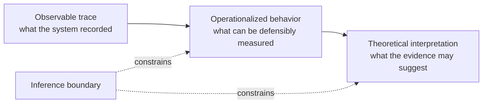
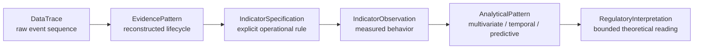
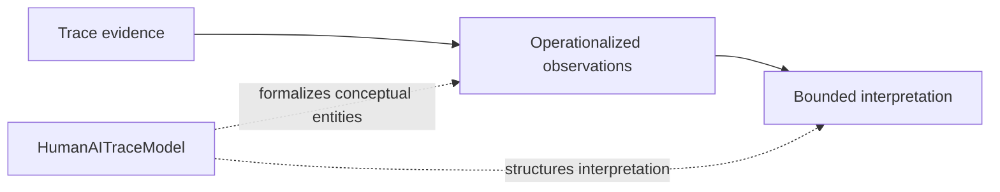
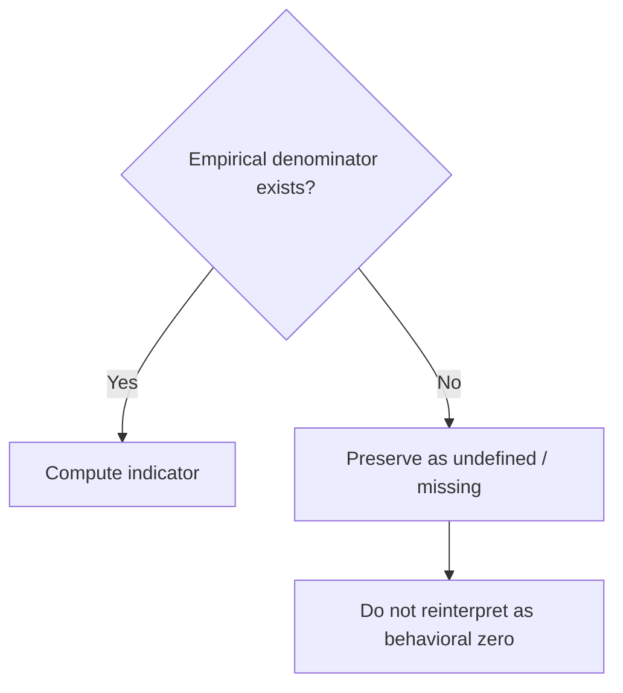
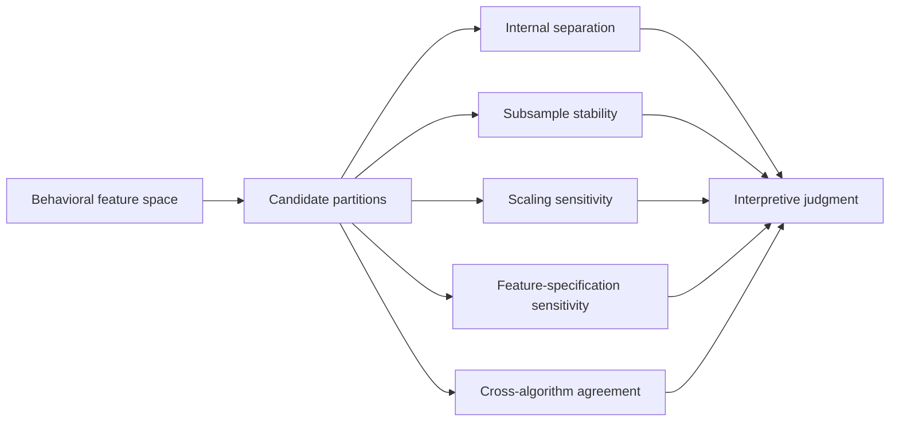
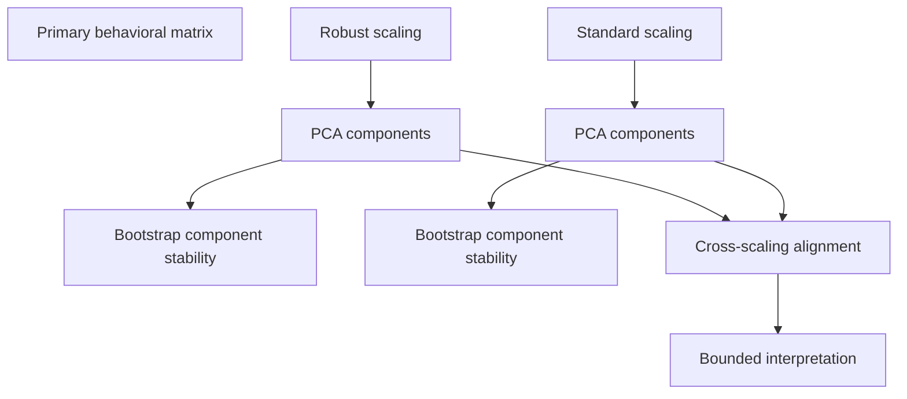
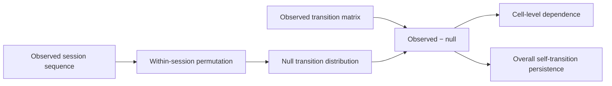
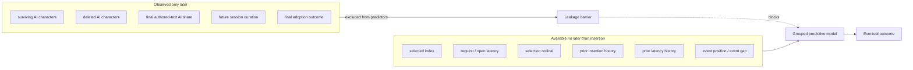
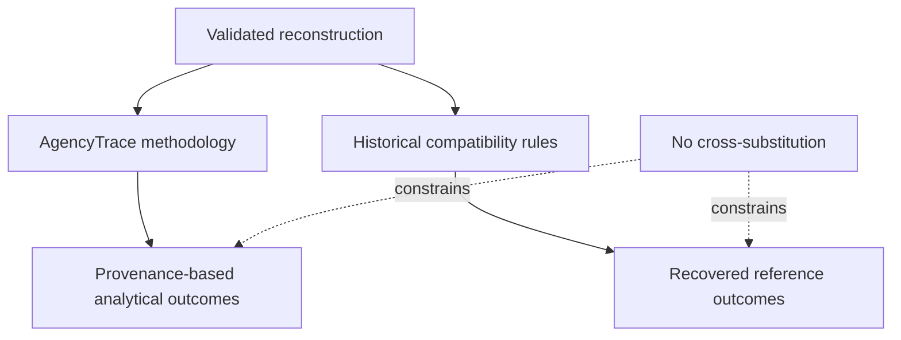
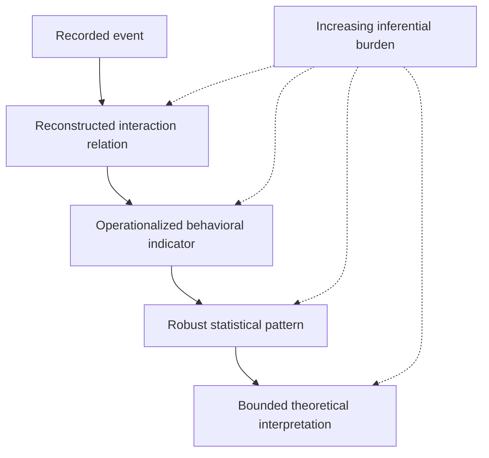

# Methodology: From Interaction Traces to Bounded Claims about Human–AI Reliance

AgencyTrace operationalizes human–AI co-writing behavior as a sequence of **observable consultation, response-use, and textual contribution events** rather than treating latent constructs such as trust, agency, or self-regulation as directly measurable from logs.

Its methodology is grounded in a Learning Analytics principle: behavioral traces acquire analytical meaning only through an explicit chain linking **data, evidence, operationalization, statistical inquiry, and inference boundaries**.

---

## How to read this document

This document is organized around the evidentiary logic of AgencyTrace.

| Section | Purpose |
|---|---|
| Epistemic stance | Defines what the trace can legitimately support |
| Reconstruction | Establishes observable interaction structure |
| Provenance | Connects response use to textual consequences |
| Operationalization | Defines trace-based indicators |
| Multivariate inquiry | Tests whether behavior forms stable types or continuous variation |
| Temporal inquiry | Examines localized sequential dependence and within-session change |
| Prospective prediction | Tests whether insertion-time evidence contains future response-use signal |
| Validity boundaries | Separates behavioral evidence from psychological interpretation |

---

## 1. Epistemic stance: trace evidence is not a latent construct

Interaction logs provide high-resolution records of behavior, but they do not directly observe cognition.

AgencyTrace therefore distinguishes three levels:



Examples of distinctions preserved throughout the methodology include:

```text
selection             ≠ trust
editing               ≠ verification
retention             ≠ understanding
dismissal             ≠ epistemic rejection
reconsultation        ≠ dependency
prediction            ≠ explanation
temporal association  ≠ causal regulation
```

This separation is not a limitation to be hidden; it is part of the construct-validity strategy.

---

## 2. Evidence chain

The AgencyTrace analytical chain is:



At each transition, AgencyTrace requires the analyst to specify what is added and what remains unobserved.

### Formalization through HumanAITraceModel

HumanAITraceModel complements this evidence chain by making its conceptual vocabulary explicit in an EMF/Ecore artifact. It provides named representations for actors, learning scenarios, interaction tasks and sequences, AI-use patterns, reliance states, learning indicators and signals, agency, regulatory configurations, and analytical representations.



The metamodel does **not** turn an interaction trace into a theoretical construct automatically. A `LearningIndicator`, `LearningSignal`, `RelianceState`, or `Agency` element remains meaningful only when its relation to observable evidence is operationally justified. HumanAITraceModel therefore supports methodological explicitness rather than replacing construct validation.

This distinction is central to the paper's observability argument: agency-related constructs become analytically useful when the path from trace evidence to interpretation is represented explicitly and its inferential limits remain visible.

---

## 3. Reconstruction before interpretation

One `suggestion-get` defines one reconstructed suggestion episode.

The reconstruction preserves:

- requests without observed responses;
- displayed suggestions;
- multiple selections within a request;
- API insertion mappings;
- dismissals;
- attributable reopens;
- orphan reopen anomalies.

The validated corpus contains:

| Reconstruction quantity | Count |
|---|---:|
| Sessions | 1,447 |
| Suggestion episodes | 18,103 |
| Selections | 12,812 |
| Confirmed insertions | 12,812 |
| Dismissed episodes | 4,088 |
| Attributable reopen events | 42 |
| Orphan reopen events | 3 |

This reconstruction is the empirical substrate of all later indicators.

---

## 4. Causal provenance as the basis of response use

AgencyTrace attributes AI-origin text through the causal chain:


This avoids replacing interaction evidence with lexical similarity.

The provenance layer supports three observable selection outcomes.

| Response-use state | Operational definition | What it captures | What it does not establish |
|---|---|---|---|
| Direct Adoption | All inserted AI-origin characters survive and remain uninterrupted | Literal preservation of the selected AI text | Trust, correctness, understanding |
| Modified Adoption | Some AI-origin text survives, but the original span is partially deleted or interrupted | Observable transformation of AI-origin text | Depth or quality of learner revision |
| Non-Adoption | No AI-origin characters from the insertion survive | Complete removal of the inserted AI text | Epistemic rejection or independent reasoning |

Validated totals are 7,833 Direct, 4,754 Modified, and 225 Non-Adoption selections.

---

## 5. From trace evidence to session-level indicators

AgencyTrace constructs session-level measures that characterize observable interaction along several dimensions.

| Analytical dimension | Trace basis | Representative indicators | Interpretive affordance |
|---|---|---|---|
| Textual contribution | Provenance of final authored text | AI share, human-origin text, AI retention | Relative textual contribution |
| Consultation intensity | Request and selection counts | consultation density, selections per request | Frequency/intensity of AI engagement |
| Response use | Selection-level provenance outcomes | Direct / Modified / Non-Adoption shares | How AI text is incorporated |
| Timing | Request/open/selection timestamps | response latency, session duration | Temporal characteristics of interaction |
| Consultation rhythm | Inter-request intervals | burstiness, reopen rate | Distribution of consultation over time |
| Human generation | Human-origin production before AI use | human-generation-before-AI ratio | Degree of observable pre-AI text production |

The indicators are behavioral proxies, not direct measurements of cognitive states.

---

## 6. Missingness as substantive information

AgencyTrace does not impute a value merely because an algorithm requires a complete matrix.

Undefined quantities are preserved as missing whenever the behavior required to define them did not occur.



Examples:

```text
no AI insertion
→ AI retention is undefined

no selection
→ Direct/Modified/Non-Adoption shares are undefined

no request
→ request-based rates are undefined
```

The primary multivariate analysis therefore uses 1,357 complete sessions rather than filling 90 incomplete sessions with behaviorally artificial values.

---

## 7. Multivariate inquiry: testing typology rather than assuming it

Clustering is used as an **exploratory hypothesis about structure**, not as a mechanism for manufacturing learner types.

The analytical sequence is:



Candidate K-means solutions can appear internally coherent while remaining unstable across reasonable preprocessing and algorithm choices.

For example:

```text
k=2 robust vs standard scaling ARI = 0.070
k=4 robust vs standard scaling ARI = 0.188
```

Cross-algorithm agreement is likewise limited for several candidate partitions.

Accordingly, AgencyTrace does **not** validate a fixed behavioral taxonomy. The stronger conclusion is that the corpus exhibits **continuous multidimensional variation**.

---

## 8. Dimensionality as descriptive structure, not latent psychology

PCA is used to interrogate whether the behavioral feature space contains reproducible low-dimensional structure.

Two questions are separated:

1. Are components stable within a given preprocessing specification?
2. Are the same components recovered when the scaling regime changes?

The first can be strong even when the second is only moderate.



AgencyTrace therefore treats PCA components as **descriptive coordinates of behavioral variation**, not as discovered psychological dimensions of agency.

---

## 9. Temporal inquiry: from sequence to dependence

Selection-level response-use states are ordered within each session.

The temporal analysis distinguishes:

```text
all consecutive transitions
cross-request transitions
intra-request transitions
```

Primary sequential inference focuses on cross-request transitions.

Validated counts are:

| Quantity | Count |
|---|---:|
| All consecutive transitions | 11,421 |
| Cross-request transitions | 11,400 |
| Intra-request transitions | 21 |
| Sessions with ≥2 selections | 1,332 |

---

## 10. Composition-preserving null model

Raw transition probabilities can appear persistent simply because a session contains many instances of the same state.

AgencyTrace therefore contrasts observed transitions with a **within-session permutation null** that preserves each session's outcome composition while disrupting local temporal order.



The observed overall self-transition rate is `0.6026`; the null mean is `0.5963`, with `p = 0.05994`.

The corpus therefore does not support a broad claim of general serial persistence.

Instead, the evidence supports **localized transition dependencies**, particularly around Non-Adoption and repeated Direct Adoption.

---

## 11. Session-weighted temporal change

AgencyTrace also asks whether response-use composition changes from earlier to later phases of a session.

Validated mean late-minus-early changes are:

| Outcome | Mean change | 95% bootstrap CI |
|---|---:|---:|
| Direct Adoption | +0.0383 | [+0.0155, +0.0617] |
| Modified Adoption | −0.0324 | [−0.0573, −0.0087] |
| Non-Adoption | −0.0059 | [−0.0134, +0.0014] |

This pattern is interpreted as a **modest corpus-level shift from Modified toward Direct Adoption**.

It is not interpreted as a universal learner trajectory or as evidence that AI use causes diminishing regulation.

---

## 12. Prospective prediction as a test of observable signal

Prediction is framed as a narrow question:

> Does the interaction history observable by the time of AI insertion contain information about the eventual provenance-based response-use outcome?

This requires a temporal leakage boundary.



The final representation contains nine insertion-time predictors.

Cross-validation is grouped by session, yielding zero train/test session overlap in every fold.

---

## 13. Prediction tasks and interpretive status

### Direct vs Modified Adoption

Histogram gradient boosting achieves:

```text
ROC-AUC            0.6231
Average precision  0.7216
Balanced accuracy  0.5859
```

Session-bootstrap inference confirms a modest improvement over the prior baseline for discrimination metrics.

This supports the claim that insertion-time traces contain **prospective behavioral signal**.

It does not support reliable individual-level prediction or causal explanation.

### Non-Adoption detection

Non-Adoption is rare:

```text
225 / 12,812 = 1.76%
```

Logistic models show weak ranking information, but threshold-based classification remains poor.

AgencyTrace therefore distinguishes **ranking signal** from **practical detection utility**.

---

## 14. Historical reproduction as methodological isolation

AgencyTrace retains a separate historical compatibility layer because earlier reference analyses use different rules for:

- request-level outcomes;
- AI-contribution calculation;
- local temporal windows;
- post-AI editing;
- reconsultation;
- response latency;
- transition entropy;
- missing-value behavior.



Exact historical reproduction is therefore a reproducibility achievement, not evidence that historical and AgencyTrace indicators are conceptually equivalent.

---

## 15. Validity framework

AgencyTrace separates several forms of validity.

| Validity concern | Control |
|---|---|
| Trace fidelity | Event-count and delta audits |
| Reconstruction fidelity | Episode/selection identity invariants |
| Provenance consistency | Selection–insertion mapping and character accounting |
| Measurement validity | Explicit denominators, missingness rules, and outcome definitions |
| Structural robustness | Scaling, feature, algorithm, and PCA sensitivity |
| Temporal inference | Composition-preserving within-session permutation |
| Predictive validity | Grouped cross-validation and insertion-time leakage control |
| Reproducibility | End-to-end rerun plus frozen release validation |

---

## 16. Threats to interpretation

The main threats are not hidden behind model performance.

### Behavioral traces are partial

Logs capture interaction with the interface, not all cognitive activity. Off-screen reasoning, external resources, rereading, reflection, and conceptual revision may be invisible.

### Provenance is textual, not intellectual

Causal text origin does not establish origin of ideas.

### Response-use outcomes are behavioral

Direct Adoption can follow careful verification; Modified Adoption can be superficial; Non-Adoption can reflect irrelevance rather than critical rejection.

### Temporal association is non-causal

A transition dependency does not demonstrate self-regulatory causation.

### Prediction is non-explanatory

Feature importance and regression coefficients characterize predictive association, not causal mechanisms.

### Corpus specificity matters

The findings characterize the observed CoAuthor interaction corpus and should not be treated as universal properties of human–AI co-writing without replication.

---

## 17. Permissible claim ladder



AgencyTrace is designed so that stronger claims require stronger evidence.

A trace can establish an action.  
A reconstructed lifecycle can establish a relation among actions.  
Provenance can establish textual persistence.  
Statistical analysis can establish patterns in those observations.  
None of these automatically establishes unobserved cognition.

That inferential discipline is the methodological core of AgencyTrace.
