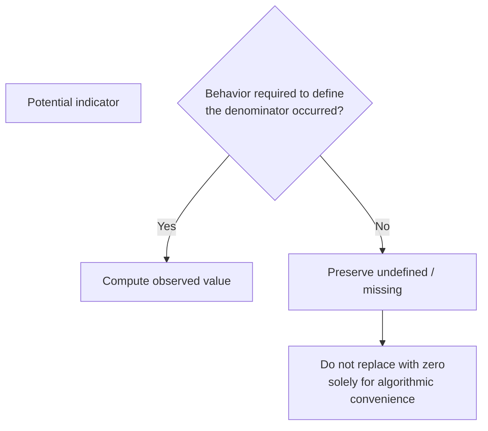

# Trace-Derived Indicators and Measurement Semantics

AgencyTrace contains two deliberately separated metric families:

1. **AgencyTrace analytical measures**, derived from validated lifecycle reconstruction and causal text provenance;
2. **historical reproduction measures**, retained to reproduce the recovered reference analysis.

They should never be mixed silently because they operationalize behavior at different units, with different denominators and temporal rules.

---

## How to read this document

Every metric should be read through five questions.

| Question | Why it matters |
|---|---|
| What is the observable evidence? | Establishes empirical grounding |
| What is the unit of analysis? | Prevents cross-level interpretation |
| What is the denominator? | Defines the construct operationally |
| When is the metric undefined? | Prevents missingness from becoming artificial zero |
| What does the metric not establish? | Defines the inference boundary |

---

# Part I — AgencyTrace analytical measures

## 1. Authored-text AI share

### Construct

Observable proportion of final authored text that retains AI causal origin.

### Operationalization

```text
final_ai_chars
────────────────────────────────────
final_ai_chars + final_human_chars
```

Initialization/system text is excluded.

At corpus level:

```text
801,131
──────────────────────── = 0.2767
801,131 + 2,094,218
```

### Interpretation

The metric characterizes **textual contribution in the reconstructed final authored material**.

It does not measure cognitive contribution, idea ownership, or effort.

---

## 2. AI retention ratio

For a session or selection with AI text inserted:

```text
surviving_ai_chars
──────────────────
inserted_ai_chars
```

Corpus totals:

```text
inserted   858,779
surviving  801,131
deleted     57,648
retention   0.9329
```

The identity:

```text
inserted_ai_chars
=
surviving_ai_chars + deleted_ai_chars
```

must hold.

### Undefined case

If no AI insertion occurred, AI retention is undefined rather than zero.

---

## 3. AI deletion ratio

Where AI insertion exists:

```text
deleted_ai_chars
────────────────
inserted_ai_chars
```

This is complementary to retention under the validated character accounting model.

The measure quantifies literal removal of AI-origin text, not semantic rejection.

---

## 4. Provenance-based response-use outcomes

Each confirmed AI selection is assigned one outcome.

| Outcome | Operational evidence | Behavioral meaning | Inference boundary |
|---|---|---|---|
| Direct Adoption | All inserted AI characters survive and remain uninterrupted | AI text is preserved literally as one continuous contribution | Does not imply uncritical acceptance |
| Modified Adoption | Some AI-origin text survives, but the original span is partially deleted or interrupted | AI text is transformed or structurally altered | Does not quantify revision quality |
| Non-Adoption | No inserted AI-origin characters survive | Inserted AI text is fully removed | Does not establish epistemic rejection |

Validated totals:

| Outcome | Count | Share |
|---|---:|---:|
| Direct Adoption | 7,833 | 61.14% |
| Modified Adoption | 4,754 | 37.11% |
| Non-Adoption | 225 | 1.76% |

---

## 5. Response-use shares

At the session level:

```text
direct_adoption_share
modified_adoption_share
non_adoption_share
```

Each share uses the number of confirmed selections as its denominator.

### Undefined case

When a session has no selections, these shares are undefined.

Zero is reserved for an observed denominator with zero instances of the relevant response-use outcome.

---

## 6. Selections per request

```text
suggestion_selections
─────────────────────
suggestion_requests
```

This is intentionally called **selections per request**, not a bounded selection rate.

A request episode can contain more than one selection, so values greater than one are possible; the validated maximum is `1.25`.

### Undefined case

If a session contains no suggestion requests, the quantity is undefined.

---

## 7. Dismissal rate

For sessions containing suggestion requests:

```text
dismissed_episodes
──────────────────
suggestion_requests
```

Dismissal is an observable interface/lifecycle outcome.

It does not uniquely encode rejection, dissatisfaction, or critical resistance.

---

## 8. Reopen rate

For sessions containing suggestion requests:

```text
suggestion_reopens
──────────────────
suggestion_requests
```

Reopen behavior characterizes renewed interaction with previously displayed AI support.

It should not be interpreted as dependence without additional evidence.

---

## 9. Multi-selection rate

At the request level, an episode is multi-selection when it contains more than one selection.

The session metric summarizes the prevalence of such episodes relative to the request base.

Because multi-selection behavior is rare, this feature is strongly zero-dominated in the validated corpus.

---

## 10. Consultation density

AgencyTrace expresses consultation intensity relative to authored textual production:

```text
suggestion_requests
────────────────────── × 1000
authored_text_chars
```

The resulting value is reported as:

```text
consultation_density_per_1000_authored_chars
```

This normalizes request frequency by the amount of authored text rather than by clock time alone.

---

## 11. Human generation before first AI insertion

AgencyTrace tracks:

```text
human_chars_before_first_ai
human_inserted_chars
human_generation_before_ai_ratio
```

The ratio characterizes how much observable human textual generation occurred before the first confirmed AI insertion, relative to the relevant human-generation base.

It is a behavioral timing indicator, not a measure of planning quality or independence.

---

## 12. Response latency

AgencyTrace records both:

```text
request_to_selection_ms
open_to_selection_ms
```

at selection level.

Session-level summaries include median and mean request-to-selection latency and median open-to-selection latency where defined.

Latency describes observable timing. Longer latency does not automatically imply deeper deliberation; shorter latency does not automatically imply uncritical acceptance.

---

## 13. Session duration

Session duration is derived from the observable temporal extent of the interaction trace.

For multivariate modeling, the primary representation uses:

```text
log_session_duration_ms
```

Log transformation is used to reduce scale asymmetry in the behavioral feature space.

---

## 14. Consultation burstiness

Consultation burstiness summarizes the dispersion of inter-request intervals.

The underlying form is:

```text
(std - mean)
────────────
(std + mean)
```

where inter-request timing is sufficiently defined.

A value closer to negative one corresponds to more regular spacing; values increasing toward positive values indicate more burst-like temporal concentration.

The metric is undefined when too few intervals exist or when the denominator is not positive.

---

## 15. Primary behavioral feature specification

The validated primary multivariate analysis uses eight features:

| Feature | Behavioral dimension |
|---|---|
| `log_authored_text_chars` | Scale of observable authored production |
| `ai_share` | Final authored-text AI contribution |
| `ai_retention_ratio` | Persistence of AI-origin text |
| `human_generation_before_ai_ratio` | Human production before first confirmed AI insertion |
| `selections_per_request` | Consultation response intensity |
| `log_median_open_to_selection_ms` | Response timing |
| `consultation_burstiness` | Temporal organization of consultation |
| `log_session_duration_ms` | Overall interaction duration |

The complete-case primary matrix contains:

```text
1,357 / 1,447 sessions = 93.78%
```

---

## 16. Missingness semantics

AgencyTrace treats missingness as part of measurement validity.



Examples:

| Situation | Correct representation |
|---|---|
| No AI insertion | AI retention = undefined |
| No selection | Adoption shares = undefined |
| No suggestion request | Request-based rates = undefined |
| Too few request intervals | Burstiness = undefined |

---

# Part II — Selection-level analytical schema

`selection_metrics.csv` contains:

```text
session_id
request_id
selection_id
request_event_num
selection_event_num
insert_event_num
selected_index
inserted_chars
surviving_chars
deleted_chars
retention_ratio
deletion_ratio
final_span_start
final_span_end
final_span_units
intervening_units
survives_contiguously
adoption_outcome
request_to_selection_ms
open_to_selection_ms
```

This table is the principal bridge between provenance reconstruction, temporal response-use analysis, and prospective selection-level prediction.

---

# Part III — Session-level analytical schema

`session_metrics.csv` contains:

```text
session_id
final_text_chars
final_ai_chars
final_human_chars
final_system_chars
final_other_chars
authored_text_chars
ai_share
document_ai_share
ai_inserted_chars
ai_surviving_chars
ai_deleted_chars
ai_retention_ratio
ai_deletion_ratio
suggestion_requests
suggestion_opens
suggestion_reopens
suggestion_selections
suggestion_insertions
dismissed_episodes
multi_selection_episodes
selection_rate
direct_adoptions
modified_adoptions
non_adoptions
direct_adoption_share
modified_adoption_share
non_adoption_share
human_inserted_chars
human_chars_before_first_ai
human_generation_before_ai_ratio
consultation_density_per_1000_authored_chars
median_request_to_selection_ms
median_open_to_selection_ms
mean_request_to_selection_ms
consultation_burstiness
session_duration_ms
```

The exported field `selection_rate` is part of the core metric file; the ML feature layer uses the more accurate analytical name `selections_per_request` because the underlying quantity is not mathematically constrained to `[0,1]`.

---

# Part IV — Historical reproduction measures

The historical compatibility layer uses a separate request-window model.

It is preserved for numerical reproducibility and should not be substituted for the provenance-based analytical definitions above.

---

## 17. Historical request outcomes

Historical request episodes are classified into five states:

```text
accept_unchanged
accepted_modified
non_adoption
presented_no_selection
request_without_suggestion
```

Validated counts:

| Historical outcome | Count |
|---|---:|
| `accept_unchanged` | 12,427 |
| `accepted_modified` | 364 |
| `non_adoption` | 3,205 |
| `presented_no_selection` | 878 |
| `request_without_suggestion` | 1,229 |
| **Total** | **18,103** |

These are request-level historical categories, not the AgencyTrace selection-level three-way provenance outcomes.

---

## 18. Historical AI contribution

Historical AI contribution is calculated from the historical request-window representation of human and AI inserted characters.

It is **not** the same quantity as final authored-text AI share.

Validated historical tertile boundaries are:

```text
Low / Moderate    0.170401
Moderate / High   0.318069
```

Session counts:

```text
Low       483
Moderate  482
High      482
```

These groups exist solely within the recovered historical analysis.

---

## 19. Historical AI retention

Historical AI retention is the mean retained fraction for qualifying historical adopted AI insertions.

The qualifying event set and request-window semantics belong to the historical compatibility model.

This measure should therefore not be substituted for provenance-based corpus or session AI retention.

---

## 20. Historical Non-Adoption

Historical Non-Adoption is the proportion of valid displayed historical response episodes classified as `Non-Adoption`.

Its denominator is defined by the recovered historical request-window model.

---

## 21. Historical post-AI editing

For each displayed historical episode, user `text-insert` and `text-delete` events are counted in the post-response window.

The window begins:

```text
after the insertion timestamp, when an insertion exists
otherwise after suggestion-open
```

and ends at the earlier of:

```text
30 seconds later
or
the next suggestion request
```

The session indicator is the median count across qualifying episodes.

---

## 22. Historical reconsultation

For each request except the final request:

```text
1  if the next suggestion request occurs within 60 seconds
0  otherwise
```

The session indicator is the mean of these flags.

---

## 23. Historical response latency

For each displayed suggestion, latency is measured from `suggestion-open` to the first meaningful user event among:

```text
suggestion-select
suggestion-close
text-insert
text-delete
cursor-forward
cursor-backward
```

The session indicator is the median valid latency in seconds.

---

## 24. Historical transition entropy

Historical response-use states are converted into adjacent transition pairs.

The entropy of the observed transition-pair distribution is normalized by the maximum entropy for the number of observed pair types.

Lower values correspond to more repetitive observed transition structure; larger values correspond to a more distributed transition pattern.

This is a historical session indicator and is distinct from the validated cross-request transition inference used in the AgencyTrace temporal layer.

---

## 25. Historical consultation burstiness

Historical consultation burstiness uses inter-request intervals:

```text
(std - mean)
────────────
(std + mean)
```

with population standard deviation (`ddof=0`).

The measure is undefined when there are too few intervals or when the denominator is not positive.

---

# Part V — Construct–indicator matrix

| Analytical construct | Observable basis | AgencyTrace operationalization | Unit | Inference boundary |
|---|---|---|---|---|
| AI consultation | Request events | Request count / density / timing | Session | Does not reveal motivation |
| Response use | Selection + final provenance | Direct / Modified / Non-Adoption | Selection | Does not establish trust |
| AI textual contribution | Final provenance | Authored-text AI share | Session / corpus | Does not measure cognitive contribution |
| AI persistence | Inserted vs surviving AI units | Retention ratio | Selection / session / corpus | Does not imply correctness |
| Human pre-AI generation | Human-origin insertion history | Human generation before first AI | Session | Does not measure planning quality |
| Consultation rhythm | Inter-request intervals | Burstiness | Session | Does not establish dependency |
| Response timing | Request/open/selection times | Latency measures | Selection / session | Does not measure deliberative depth |
| Reliance dynamics | Ordered response-use states | Transition and phase analyses | Sequence / session | Does not establish causal regulation |
| Prospective behavioral signal | Insertion-time features | Grouped prediction | Selection | Prediction is not explanation |

---

## Measurement principle

AgencyTrace treats a metric as scientifically interpretable only when its:

```text
observable evidence
+ unit of analysis
+ denominator
+ missingness rule
+ inference boundary
```

are all explicit.

A number without those five elements is not treated as a construct measurement.
