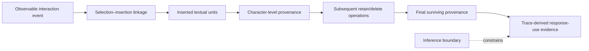
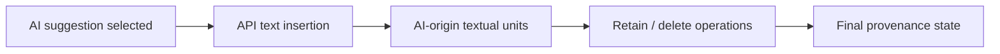
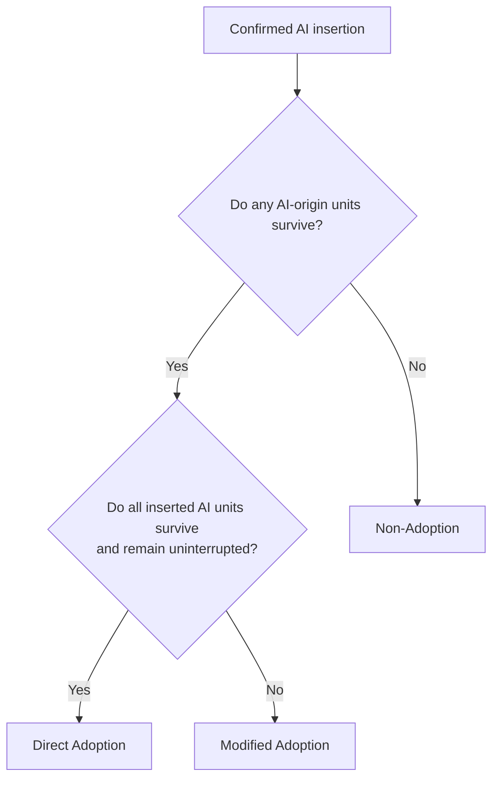
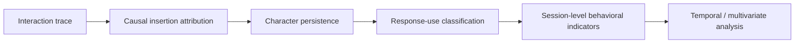

# Causal Text Provenance as Behavioral Evidence

AgencyTrace treats provenance not as an implementation detail, but as an evidentiary layer that connects observable interaction events to defensible measures of human–AI contribution.

The central question is deliberately narrow:

> **Which observable insertion event accounts for the textual units that remain in the reconstructed document?**

This formulation is important. AgencyTrace does not infer authorship from lexical similarity, semantic resemblance, or post hoc comparison with an AI suggestion. Instead, it reconstructs the causal event pathway through which textual units entered, persisted in, or disappeared from the document.

---

## How to read this document

This document distinguishes four analytical levels:

| Level | Question addressed |
|---|---|
| Event evidence | Which observable event introduced the text? |
| Provenance reconstruction | Which causal origin is assigned to each textual unit? |
| Persistence evidence | Which units survive, are deleted, or are interrupted? |
| Interpretive boundary | What can and cannot be inferred from textual persistence? |

The provenance layer therefore supplies **behavioral evidence**, not psychological labels.

---

## Evidence-to-provenance architecture



The analytical sequence is intentionally directional. A final textual span is not first inspected and then attributed retrospectively; its origin is propagated forward from the event that introduced it.

---

## Provenance classes

AgencyTrace distinguishes four causal-origin classes.

| Provenance class | Empirical basis | Analytical role | Interpretive boundary |
|---|---|---|---|
| Initial / system | Text present in the initial `currentDoc` state | Separates pre-existing material from subsequently authored text | Does not identify who originally authored the pre-existing material |
| Human | String content introduced by user-origin text insertion events | Operationalizes observable human textual contribution | Human-origin text is not equivalent to independently generated cognition |
| AI | Text introduced by an API insertion causally linked to a reconstructed AI selection | Supports AI retention, modification, and authored-text contribution measures | AI-origin text does not imply passive acceptance, agreement, or misunderstanding |
| Other / unknown | Text for which validated causal attribution is unavailable | Preserves attribution uncertainty rather than forcing a label | Must not be redistributed into human or AI categories without evidence |

The validated corpus ends with **zero final other-origin textual characters**.

---

## Why causal attribution matters

Similarity-based attribution can conflate several phenomena:

- verbatim AI reuse;
- learner paraphrasing;
- coincidental lexical overlap;
- repeated task vocabulary;
- pre-existing text.

AgencyTrace avoids these ambiguities by following the observable event chain:



AI origin is therefore an **event-causal property**.

This distinction is methodologically consequential: provenance establishes where observable text entered the interaction history, whereas semantic similarity estimates how much two strings resemble one another. These are different constructs.

---

## Quill delta replay

Document reconstruction follows the sequential semantics of Quill deltas.

Observed operations include:

| Delta operation | Provenance consequence |
|---|---|
| `retain` | Advances through existing document units while preserving origin |
| string `insert` | Introduces new textual units with the origin of the generating event |
| non-string `insert` | Occupies a logical document position but is excluded from textual-character measures |
| `delete` | Removes both the textual unit and its associated provenance |
| attributes | Modifies presentation metadata without changing textual origin |

The corpus contains a single non-string image embed. It is preserved as a logical position during replay but excluded from character-based contribution measures.

---

## Provenance propagation

Conceptually, the reconstructed document can be represented as a sequence of paired units:

```text
(character, causal origin)
```

For example:

```text
T[human] h[human] e[human]
A[AI] I[AI]
```

A later deletion removes both the character and its provenance label.

A later human insertion between two AI-origin units does not change the causal origin of the surviving AI units, but it does alter the continuity of the original AI span. This distinction underpins the difference between **Direct Adoption** and **Modified Adoption**.

---

## From provenance to response-use evidence



These labels characterize **observable response use**.

They do not directly encode trust, epistemic agreement, comprehension, or learning.

---

## Character-level accounting

For each confirmed AI insertion, AgencyTrace maintains:

```text
inserted AI characters
surviving AI characters
deleted AI characters
```

The accounting identity is:

```text
inserted = surviving + deleted
```

Validated corpus totals:

| Quantity | Characters |
|---|---:|
| AI inserted | 858,779 |
| AI surviving | 801,131 |
| AI deleted | 57,648 |

The identity holds exactly over the validated corpus.

---

## Final provenance partition

The reconstructed final textual corpus contains:

| Origin | Final characters |
|---|---:|
| AI | 801,131 |
| Human | 2,094,218 |
| Initial / system | 464,416 |
| Other / unknown | 0 |
| **Total textual characters** | **3,359,765** |

The final provenance partition therefore satisfies:

```text
AI + human + system + other = final textual characters
```

---

## AI retention

AI-character retention measures the fraction of causally attributed AI text that remains in the reconstructed final document.

At corpus level:

```text
801,131 / 858,779 = 0.9329
```

Retention should be interpreted as **literal persistence of causally attributed textual material**.

It is not:

- semantic similarity;
- correctness;
- agreement;
- trust;
- learning;
- evidence that the learner understood the retained content.

---

## Authored-text AI share

AgencyTrace distinguishes authored text from initialization/system material.

The authored-text AI share is:

```text
final AI-origin characters
────────────────────────────────────────
final AI-origin + final human-origin characters
```

For the validated corpus:

```text
0.2767
```

The denominator intentionally excludes initialization/system text.

This measure therefore characterizes the observable textual composition of authored material rather than the entire reconstructed document state.

---

## Provenance as an evidentiary bridge



Provenance is the bridge that prevents downstream behavioral measures from being detached from the events that generated them.

Without this layer, statements about AI contribution or modification would rely on post hoc textual resemblance rather than observable interaction evidence.

---

## Internal validity checks

The provenance audit verifies:

| Invariant | Validated result |
|---|---:|
| Raw API insertion events | 12,812 |
| Mapped selection insertions | 12,812 |
| Missing insertion mappings | 0 |
| Duplicate insertion mappings | 0 |
| Insertion-length mismatches | 0 |
| AI accounting failures | 0 |
| Final other-origin characters | 0 |

These checks establish internal accounting consistency.

They do not constitute external validation of the reconstructed final document.

---

## External final-document boundary

All 1,447 sessions contain an initial `currentDoc`.

No later independent final `currentDoc` snapshot is present in the corpus.

Accordingly:

```text
internal event/delta/provenance consistency    validated
independent final-document comparison          unavailable
```

AgencyTrace therefore makes a bounded validation claim: the reconstruction is internally consistent with the observable event stream, but no independent final-document ground truth exists against which every reconstructed final document can be compared.

---

## Epistemic boundary

Provenance can support the claim:

> An observable AI insertion causally introduced these textual units, and these units remained in the reconstructed document.

It cannot, by itself, support claims such as:

> The learner accepted the underlying idea.

> The learner trusted the AI.

> The learner learned from the suggestion.

> The learner surrendered decision authority.

> The AI authored the learner's intellectual contribution.

A learner may critically evaluate and retain AI-origin text. A learner may paraphrase AI content using human-origin keystrokes. Human-origin text may itself reproduce external material.

AgencyTrace therefore treats provenance as **behavioral evidence with an explicit inferential ceiling**, not as a direct measure of cognition.
