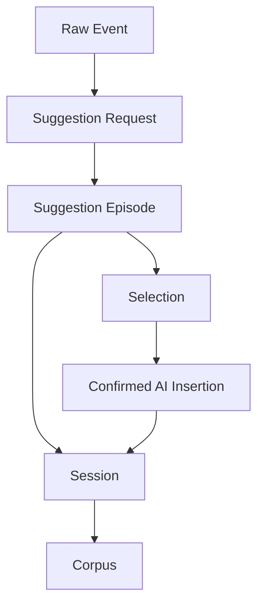
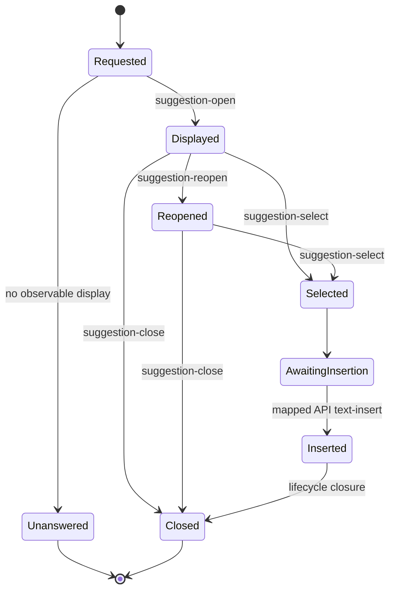
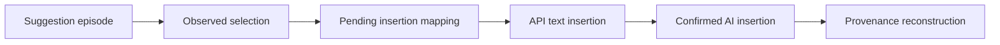
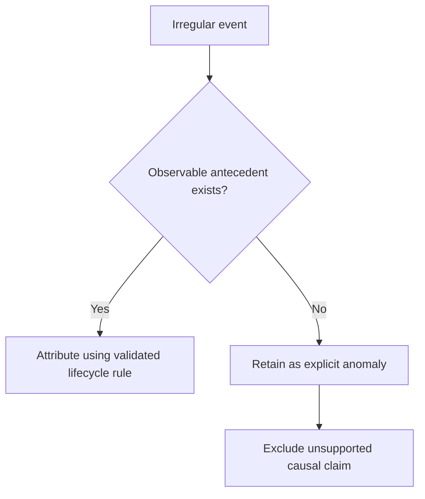
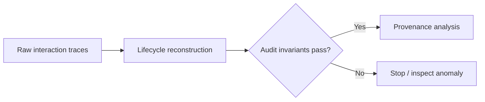

# From Event Streams to Analytically Valid Suggestion Episodes

Suggestion lifecycle reconstruction establishes the observational foundation on which all subsequent AgencyTrace measures depend.

The objective is not to simplify the trace into a convenient story. It is to recover the strongest interaction structure justified by the observable event sequence while preserving ambiguity, multiplicity, and anomalous events where they occur.

---

## How to read this document

The reconstruction layer answers three questions:

| Question | Analytical purpose |
|---|---|
| What constitutes an observable AI-support episode? | Defines the unit on which consultation behavior is measured |
| How are selections connected to insertions? | Establishes the causal bridge required for provenance |
| What happens when the trace is incomplete or irregular? | Prevents unsupported reconstruction from becoming hidden analytical assumptions |

---

## Unit hierarchy



The units are not interchangeable.

An event is an observation.  
An episode is a reconstructed interaction lifecycle.  
A selection is a response-use action within that lifecycle.  
A session is an ordered collection of such interactions.

---

## Reconstruction principle

One observable `suggestion-get` event instantiates one `SuggestionEpisode`.

Therefore:

```text
number of reconstructed suggestion episodes
=
number of observed suggestion-get events
```

Validated corpus:

| Quantity | Count |
|---|---:|
| `suggestion-get` events | 18,103 |
| Reconstructed suggestion episodes | 18,103 |

This one-to-one invariant prevents the reconstruction process from either dropping requests or manufacturing unobserved ones.

---

## Lifecycle architecture

Suggestion interaction is not assumed to follow a perfectly linear request → display → selection → insertion sequence.

AgencyTrace therefore maintains distinct observable states.



The diagram expresses analytical states, not assumptions that every episode traverses every state.

---

## Requests without displays

A suggestion request remains analytically observable even when no later display event can be attributed to it.

AgencyTrace retains these requests because absence of a subsequent observable response is itself part of the interaction record.

It does not silently delete requests simply because they cannot contribute to a later selection or insertion.

This preserves the distinction between:

- a request that occurred;
- a suggestion that was displayed;
- a suggestion that was selected;
- text that was ultimately inserted.

---

## Selection reconstruction

Selections are reconstructed at **event identity level**.

The lifecycle audit compares the identities of observed `suggestion-select` events with the selections represented by the reconstructed episodes.

Validated result:

| Selection invariant | Count |
|---|---:|
| Raw `suggestion-select` events | 12,812 |
| Reconstructed selections | 12,812 |
| Missing raw selections | 0 |
| Spurious reconstructed selections | 0 |
| Duplicate reconstructed selections | 0 |
| Sessions with selection mismatch | 0 |

This goes beyond matching corpus totals: the corresponding observable selection events are preserved.

---

## Multiplicity within an episode

Suggestion episodes are not forced into a one-request/one-selection model.

Validated corpus:

| Multiplicity indicator | Value |
|---|---:|
| Episodes with more than one selection | 19 |
| Maximum selections in one episode | 3 |

This matters analytically because a ratio such as selections per request can legitimately exceed one.

Collapsing an episode to a single selection would erase observable response-use behavior.

---

## Selection–insertion pairing

A reconstructed selection becomes a confirmed AI insertion only when the trace supports its association with an API-generated text insertion.



Validated corpus:

| Quantity | Count |
|---|---:|
| Reconstructed selections | 12,812 |
| Confirmed mapped insertions | 12,812 |
| Missing mappings | 0 |
| Duplicate mappings | 0 |

No synthetic insertion is created to repair an unmatched lifecycle.

---

## Dismissal as observable interaction behavior

AgencyTrace identifies 4,088 dismissed episodes from observable lifecycle evidence.

Dismissal is treated as an interactional event, not as a psychological conclusion.

A dismissed suggestion may reflect many possibilities, including:

- irrelevance;
- timing;
- interface behavior;
- task completion;
- dissatisfaction;
- strategic non-use.

The trace itself does not uniquely distinguish among these explanations.

---

## Reopen semantics

The corpus contains 45 `suggestion-reopen` events.

AgencyTrace attributes a reopen only where the observable lifecycle provides an antecedent episode.

| Reopen status | Count |
|---|---:|
| Attributable reopen events | 42 |
| Orphan reopen events | 3 |

The three orphan reopen events remain explicit anomalies.

They are not repaired by fabricating synthetic request episodes.

---

## Preserving anomaly rather than manufacturing certainty



This policy is central to AgencyTrace.

An incomplete trace should reduce inferential certainty, not trigger undocumented reconstruction.

---

## Event ordering

Reconstruction follows the observable event sequence.

Timestamp regressions are retained as auditable anomalies rather than being silently used to reorder the session into a more convenient chronology.

The event sequence and event identity therefore remain the primary reconstruction anchors.

---

## Reconstruction invariants

The lifecycle layer is accepted only when all of the following conditions hold.

| Validity criterion | Meaning |
|---|---|
| Episode conservation | Every observable request yields exactly one reconstructed episode |
| Selection conservation | Every observable selection is represented once and only once |
| Identity preservation | Reconstructed selections correspond to the same raw selection events |
| Insertion consistency | Confirmed selections and API insertions are paired without duplication or fabrication |
| Reopen accounting | Every reopen is either attributed to an observable antecedent or retained as an orphan anomaly |

The validated corpus satisfies all five criteria.

---

## Reconstruction as a validity gate



Downstream provenance and behavioral analysis are meaningful only after this gate has been satisfied.

---

## What reconstruction establishes

The reconstruction layer establishes:

- observable request structure;
- display and reopen relations;
- selection identity;
- multi-selection episodes;
- selection–insertion mappings;
- temporal ordering sufficient for downstream analysis.

---

## What reconstruction does not establish

Lifecycle reconstruction does not directly establish:

| Construct | Why the trace is insufficient at this layer |
|---|---|
| Trust | Selection can occur without epistemic trust |
| Learning | No learning gain follows directly from a UI event |
| Verification | Editing or selection does not reveal the reasoning process |
| Cognitive effort | Interaction frequency is not equivalent to mental effort |
| Agency | Agency requires an explicit operational framework beyond event presence |
| Regulation | Temporal order alone does not demonstrate self-regulatory control |
| Decision quality | Observable action does not establish whether a decision was appropriate |

Reconstruction is therefore a **precondition for interpretation**, not interpretation itself.
