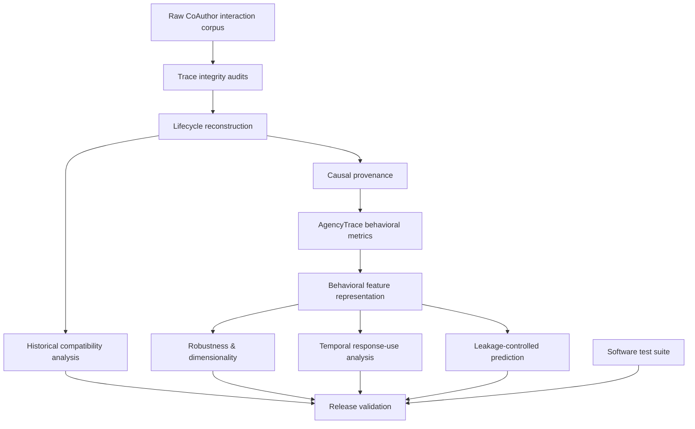
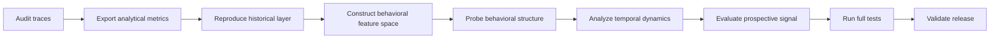

# Reproducibility as Methodological Control

AgencyTrace treats reproducibility as part of the research design rather than as a post hoc software convenience.

The objective is to ensure that every reported analytical result can be regenerated from the same observable interaction corpus through a sequence of explicit, auditable transformations.

---

## How to read this document

The reproduction workflow serves four methodological functions:

| Function | Research purpose |
|---|---|
| Evidence preservation | Ensures downstream results remain traceable to observable events |
| Transformation transparency | Makes operationalization steps inspectable |
| Analytical isolation | Separates historical compatibility from AgencyTrace analytical definitions |
| Release verification | Prevents publication outputs from drifting away from validated corpus invariants |

---

## Reproducibility architecture



Each analytical layer remains downstream of validated reconstruction rather than accessing the raw traces through an independent, undocumented pathway.

---

## Environment

AgencyTrace requires:

```text
Python >= 3.11
NumPy
Matplotlib
scikit-learn
```

Development and verification additionally use Pytest.

Recommended editable installation:

```bash
python -m pip install -e ".[dev,ml]"
```

---

## Corpus basis

Expected corpus location:

```text
data/raw/
```

Validated corpus:

| Corpus property | Value |
|---|---:|
| Sessions | 1,447 |
| Observable events | 2,701,458 |
| Suggestion requests | 18,103 |
| Suggestion selections | 12,812 |

Raw JSONL files are treated as immutable source evidence.

The reproduction workflow reads from this layer but does not rewrite it.

---

## HumanAITraceModel artifact

The release also contains the formal **HumanAITraceModel** research artifact:

```text
HumanAITraceModel/model/HumanAITraceModel.ecore
HumanAITraceModel/model/HumanAITraceModel.genmodel
HumanAITraceModel/model/HumanAITraceModel.aird
```

The metamodel is versioned with the repository but is **not an execution dependency of the Python reproduction pipeline**. This distinction is intentional: empirical reproducibility concerns reconstruction, measurement, and analysis from the corpus, whereas the Ecore artifact captures the conceptual schema used to organize and communicate the trace-to-indicator interpretation.

The `.ecore` and `.genmodel` resources are EMF artifacts and the `.aird` resource preserves the Sirius representation. Standard XML parsing can establish document well-formedness; full model-level inspection is appropriately performed with EMF/Sirius tooling.

A reproducible research release should therefore preserve both:

```text
empirical reproducibility  → scripts + corpus + validated outputs
conceptual reproducibility → versioned HumanAITraceModel resources
```

---

## One-command reproduction

The complete research workflow is executed with:

```bash
python scripts/reproduce_all.py
```

The public CLI provides the corresponding orchestration command:

```bash
agencytrace reproduce
```

The workflow is fail-closed: a stage returning a non-zero status prevents later stages from being treated as successfully reproduced.

---

## Analytical sequence



The current full workflow comprises the following research stages:

| Stage | Methodological role |
|---|---|
| Text-delta audit | Verifies document-edit operations before reconstruction |
| Suggestion lifecycle audit | Establishes request/selection/insertion fidelity |
| Provenance audit | Verifies causal text-origin accounting |
| Analytical metric export | Materializes AgencyTrace session- and selection-level measures |
| Metric audit | Checks denominators, outcome accounting, and corpus invariants |
| Historical target reproduction | Preserves compatibility with recovered reference definitions |
| Historical analysis | Reproduces historical AI-share and correlation results |
| Historical figure reproduction | Recreates the validated historical analytical figures |
| Behavioral feature export | Constructs the session-level analytical feature representation |
| Feature audit | Preserves missingness and validates feature semantics |
| Feature diagnostics | Examines distributions, redundancy, and pairwise structure |
| Matrix preparation | Defines the complete-case primary multivariate analysis set |
| Exploratory clustering | Tests candidate behavioral partitions |
| Cluster profiling | Describes candidate partitions without psychological reification |
| Robustness analysis | Tests sensitivity to feature removal, scaling, and algorithm |
| Dimensionality analysis | Examines continuous multivariate structure and preprocessing dependence |
| Temporal analysis | Tests response-use transitions and within-session change |
| Prediction analysis | Evaluates leakage-controlled insertion-time prospective signal |
| Test suite | Verifies reusable software behavior |
| Release validation | Checks frozen corpus and analytical invariants |

---

## Why the sequence matters

Reproducibility is not only about obtaining the same files.

The order encodes an evidentiary dependency:

```text
prediction
depends on behavioral features

behavioral features
depend on validated analytical metrics

analytical metrics
depend on causal provenance

causal provenance
depends on lifecycle reconstruction

lifecycle reconstruction
depends on observable event integrity
```

A downstream result is therefore never considered valid merely because its script executes successfully.

---

## Generated analytical layers

### AgencyTrace core

```text
data/processed/session_metrics.csv
data/processed/selection_metrics.csv
```

### Historical compatibility layer

```text
data/processed/target_behavior_metrics.csv
data/processed/request_outcomes.csv

data/analysis/target_behavior_correlations.csv
data/analysis/target_behavior_sample_sizes.csv
data/analysis/target_outcomes_by_ai_share.csv
```

### Behavioral feature representation

```text
data/processed/ml_session_features.csv
data/processed/ml_session_features_manifest.json
```

### Multivariate robustness

```text
data/analysis/ml/clustering/
data/analysis/ml/dimensionality/
```

### Temporal analysis

```text
data/analysis/ml/transitions/
```

### Prospective prediction

```text
data/analysis/ml/prediction/
```

### Historical figure outputs

```text
figures/ai_share_response_outcomes.png
figures/ai_share_response_outcomes.pdf
figures/trace_indicator_correlations.png
figures/trace_indicator_correlations.pdf
```

No additional figures are required by the final analytical workflow.

---

## Historical compatibility as a separate analytical regime

The historical reproduction layer intentionally preserves definitions necessary to reproduce the recovered reference analysis.

This includes historical request-window semantics and the numerical behavior of NumPy operations over empty collections.

Consequently, warnings such as:

```text
RuntimeWarning: Mean of empty slice
RuntimeWarning: invalid value encountered in scalar divide
```

may appear where the historical definition itself produces an undefined mean.

These values are compatibility-preserving behavior rather than evidence that the AgencyTrace analytical layer should redefine missingness in the same way.

---

## Reproducibility and missingness

AgencyTrace analytical features preserve undefined quantities as missing whenever their denominator or empirical basis is absent.

This policy prevents analytical absence from being recoded as behavioral zero.

For example:

```text
no AI insertion
≠
zero AI retention
```

and:

```text
no selection
≠
zero direct-adoption share
```

Historical compatibility and AgencyTrace measurement therefore remain conceptually separated.

---

## Stochastic analyses

Some robustness and prediction procedures involve stochastic resampling or model fitting.

The stochastic analyses are rerun through fixed scripted specifications covering grouped cross-validation, bootstrap procedures, permutation-null analysis, and clustering robustness. Reproducibility here refers to the documented analytical implementation and software environment; bit-identical floating-point results are not assumed across every platform or numerical-library version.

---

## Fast reproduction

When corpus-level audits have already been independently verified:

```bash
python scripts/reproduce_all.py --skip-audits
```

This mode skips selected integrity audits but still regenerates the downstream analytical workflow and performs release validation.

It should not be used as a substitute for a full validation when preparing a new research release.

---

## Tests, audits, and release validation

These mechanisms address different forms of validity.

| Mechanism | Scope | Question |
|---|---|---|
| Unit/integration tests | Reusable software behavior | Does the implementation behave as specified on controlled cases? |
| Corpus audits | Full empirical corpus | Do reconstruction and accounting invariants hold over all sessions? |
| Robustness analyses | Analytical specification | Do substantive conclusions survive reasonable modeling choices? |
| Release validator | Frozen artifact | Does the regenerated release still satisfy the documented research invariants? |

No single layer substitutes for the others.

---

## Current validated release

The complete pipeline has been executed successfully on the full corpus.

Validated terminal state:

```text
68 passed

AgencyTrace release validation PASSED.
AgencyTrace reproduction completed successfully.
```

The latest complete reproduction required approximately:

```text
7.6 minutes
```

on the validated local environment.

Execution time is descriptive rather than a scientific invariant.

---

## Reproduction claims

AgencyTrace supports the following bounded claims:

1. observable suggestion lifecycles can be reconstructed while preserving all validated request and selection identities;
2. causal text provenance satisfies the documented accounting invariants;
3. analytical response-use measures can be regenerated from that provenance;
4. the historical compatibility layer reproduces the recovered target numerical results;
5. exploratory multivariate results are accompanied by robustness analyses;
6. temporal claims are evaluated against composition-preserving null models;
7. predictive evaluation respects session-level separation and insertion-time leakage boundaries.

AgencyTrace does **not** claim that reproducibility alone establishes construct validity, causality, or psychological interpretation.

---

## Recommended release protocol

```bash
python -m pytest -q
python scripts/reproduce_all.py
python scripts/validate_release.py
git diff --check
git status
```

A research release should not be finalized while any full-corpus audit, test, or release-validation gate fails.
