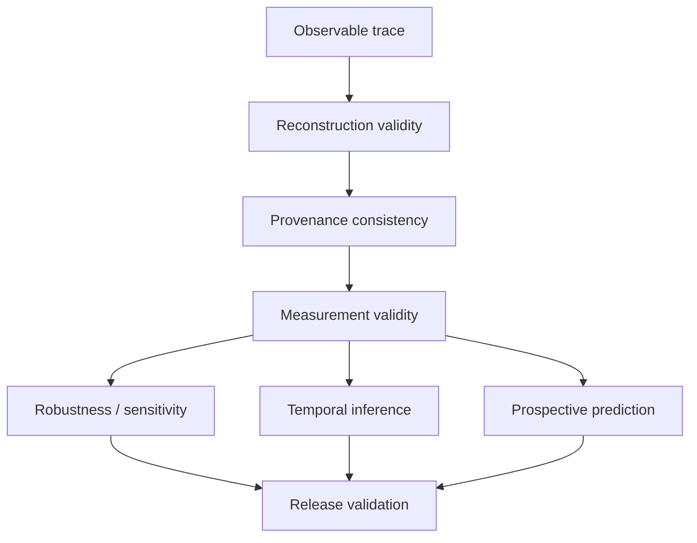
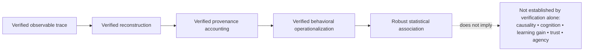

# Verification and Validity Protocol

This document records the frozen verification state of AgencyTrace `v0.1.1`.

**Latest full-corpus verification:** 4 October 2026.

AgencyTrace treats verification as a layered validity argument rather than a single pass/fail software test.

---

## How to read this document

The verification framework distinguishes:

| Validity layer | Primary concern |
|---|---|
| Trace integrity | Are observable events preserved correctly? |
| Reconstruction validity | Are interaction episodes reconstructed without fabrication or loss? |
| Provenance consistency | Are textual origins causally and arithmetically coherent? |
| Measurement consistency | Do analytical indicators respect their definitions and denominators? |
| Robustness | Are multivariate conclusions dependent on arbitrary analytical choices? |
| Temporal inference | Do sequential patterns exceed composition-preserving expectations? |
| Predictive validity | Does prospective signal survive leakage control and session isolation? |
| Release reproducibility | Can the complete analytical state be regenerated and validated? |

---

## Verification architecture



A downstream analytical result cannot compensate for a failed upstream validity gate.

---

## Software verification

Current test suite:

```text
68 passed
```

The suite covers core reconstruction, provenance, metrics, CLI behavior, feature processing, clustering diagnostics, dimensionality analysis, transitions, temporal inference, prediction tasks, and prediction inference.

Software tests are necessary but not sufficient: scientific invariants are additionally evaluated over the complete corpus.

---

## Full-corpus reconstruction

Validated result:

| Quantity | Value |
|---|---:|
| Input sessions | 1,447 |
| Successfully reconstructed | 1,447 |
| Failed | 0 |
| Observable events | 2,701,458 |
| Suggestion requests | 18,103 |
| Suggestion selections | 12,812 |
| Dismissed episodes | 4,088 |
| Reopen events | 45 |

Core event counts include:

| Event | Count |
|---|---:|
| `suggestion-get` | 18,103 |
| `suggestion-open` | 17,012 |
| `suggestion-reopen` | 45 |
| `suggestion-select` | 12,812 |
| `suggestion-close` | 16,967 |

---

## Lifecycle reconstruction validity

Validated reconstruction:

| Criterion | Result |
|---|---:|
| Reconstructed episodes | 18,103 |
| Reconstructed selections | 12,812 |
| Reconstructed insertions | 12,812 |
| Missing raw selections | 0 |
| Spurious reconstructed selections | 0 |
| Duplicate reconstructed selections | 0 |
| Selection-mismatch sessions | 0 |
| Attributable reopen events | 42 |
| Orphan reopen events | 3 |
| Multi-selection episodes | 19 |
| Maximum selections in one episode | 3 |

The lifecycle audit therefore establishes both **count conservation** and **event-identity consistency**.

---

## Provenance consistency

Validated selection–insertion accounting:

| Provenance invariant | Result |
|---|---:|
| Raw API text insertions | 12,812 |
| Mapped selection insertions | 12,812 |
| Missing mappings | 0 |
| Duplicate mappings | 0 |
| Raw API inserted characters | 858,779 |
| Provenance AI inserted characters | 858,779 |
| Insertion-length mismatches | 0 |
| AI accounting failures | 0 |

Final provenance:

| Origin | Characters |
|---|---:|
| AI | 801,131 |
| Human | 2,094,218 |
| Initial/system | 464,416 |
| Other | 0 |
| **Total** | **3,359,765** |

AI characters deleted:

```text
57,648
```

Corpus AI retention:

```text
0.9329
```

The final provenance partition and AI insertion accounting identities both pass.

---

## External final-document boundary

Every session contains an initial `currentDoc`.

No independent later final `currentDoc` snapshot exists.

Accordingly:

| Validation target | Status |
|---|---|
| Internal delta application | PASS |
| Selection–insertion mapping | PASS |
| Provenance accounting | PASS |
| Final provenance partition | PASS |
| Independent final-document comparison | N/A |

AgencyTrace therefore claims internal reconstruction consistency, not external final-document ground-truth agreement.

---

## Measurement validity

Validated provenance-based response-use outcomes:

| Response-use state | Count | Share |
|---|---:|---:|
| Direct Adoption | 7,833 | 61.14% |
| Modified Adoption | 4,754 | 37.11% |
| Non-Adoption | 225 | 1.76% |
| **Total** | **12,812** | **100%** |

Internal substructure:

| Evidence pattern | Count |
|---|---:|
| Complete but interrupted AI spans | 1,694 |
| Partial AI survival | 3,060 |
| Zero AI survival | 225 |

Corpus authored-text AI share:

```text
0.2767
```

This share excludes initialization/system material.

---

## Historical reproduction validity

The compatibility layer reproduces the historical request-level outcome partition exactly:

| Historical state | Count |
|---|---:|
| `accept_unchanged` | 12,427 |
| `accepted_modified` | 364 |
| `non_adoption` | 3,205 |
| `presented_no_selection` | 878 |
| `request_without_suggestion` | 1,229 |
| **Total** | **18,103** |

All differences relative to the recovered historical reference counts are zero.

---

## Historical AI-contribution stratification

Validated thresholds:

| Boundary | Value |
|---|---:|
| Low / Moderate | 0.170401 |
| Moderate / High | 0.318069 |

Session distribution:

| Group | Sessions |
|---|---:|
| Low | 483 |
| Moderate | 482 |
| High | 482 |

Request totals:

| Group | Requests |
|---|---:|
| Low | 2,790 |
| Moderate | 5,370 |
| High | 9,943 |

These groups belong to the historical compatibility analysis and are not substituted for AgencyTrace authored-text AI share.

---

## Historical correlation reproduction

The recovered 10 × 10 Spearman matrix is reproduced numerically with:

```text
maximum absolute difference = 0.0
```

This establishes exact numerical compatibility with the recovered historical matrix.

It does not imply that the indicators themselves are interchangeable with the provenance-based AgencyTrace measures.

---

## Behavioral feature validity

The behavioral feature table retains all:

```text
1,447 sessions
```

Primary complete-case multivariate analysis includes:

```text
1,357 sessions
93.78% coverage
```

Undefined quantities are preserved as missing rather than automatically recoded as zero.

This distinction is verified during feature auditing.

---

## Robustness of discrete behavioral partitions

Exploratory clustering produces locally stable solutions under some configurations, but membership is sensitive to reasonable analytical choices.

Examples include:

```text
k=2 robust-scaling vs standard-scaling ARI = 0.070
k=4 robust-scaling vs standard-scaling ARI = 0.188
```

Cross-algorithm agreement is also limited for several candidate solutions.

Accordingly:

> AgencyTrace does not validate a fixed discrete taxonomy of learner or user types.

The stronger supported conclusion is continuous multidimensional behavioral variation.

---

## Dimensionality robustness

PCA components are reproducible within some preprocessing specifications, but individual components are not invariant across scaling regimes.

For example:

```text
robust vs standard PC1 alignment |cos| = 0.670
```

Cross-scaling component agreement is only partial, so the PCA solution is not treated as invariant to preprocessing. AgencyTrace therefore uses PCA as a descriptive sensitivity analysis rather than as evidence for fixed latent psychological dimensions.

---

## Temporal validity

The validated corpus contains:

| Temporal quantity | Count |
|---|---:|
| Consecutive selection transitions | 11,421 |
| Cross-request transitions | 11,400 |
| Intra-request transitions | 21 |
| Sessions with at least two selections | 1,332 |

Cross-request transition probabilities:

| Previous state | Direct | Modified | Non-Adoption |
|---|---:|---:|---:|
| Direct | 0.695 | 0.296 | 0.009 |
| Modified | 0.512 | 0.467 | 0.021 |
| Non-Adoption | 0.362 | 0.462 | 0.176 |

---

## Composition-preserving temporal null

AgencyTrace evaluates serial dependence against a within-session permutation null that preserves:

- session length;
- number of selections;
- session outcome composition;
- request adjacency structure.

Observed overall self-transition rate:

```text
0.6026
```

Null mean:

```text
0.5963
```

Difference:

```text
+0.0063
```

Permutation test:

```text
p = 0.05994
```

The evidence therefore does not support a broad claim of general serial persistence.

---

## Localized transition dependencies

Several transition cells differ from the composition-preserving null after multiplicity correction.

Particularly notable patterns include:

| Transition | Observed | Null | Difference | FDR q |
|---|---:|---:|---:|---:|
| Non-Adoption → Direct | 0.362 | 0.490 | −0.128 | 0.0060 |
| Non-Adoption → Non-Adoption | 0.176 | 0.081 | +0.095 | 0.0060 |
| Direct → Direct | 0.695 | 0.686 | +0.008 | 0.0135 |
| Direct → Non-Adoption | 0.009 | 0.014 | −0.005 | 0.0060 |

The temporal evidence is therefore characterized as **localized dependency rather than broad persistence**.

---

## Session-weighted temporal change

Within-session early-to-late change:

| Outcome | Mean late − early | Bootstrap 95% CI |
|---|---:|---:|
| Direct Adoption | +0.0383 | [+0.0155, +0.0617] |
| Modified Adoption | −0.0324 | [−0.0573, −0.0087] |
| Non-Adoption | −0.0059 | [−0.0134, +0.0014] |

The corpus exhibits a modest shift from Modified toward Direct Adoption.

Because individual-session median change is zero, this result is interpreted as a corpus-level tendency rather than a universal learner trajectory.

---

## Predictive validity and leakage control

Prospective prediction uses only information observable at or before the AI insertion event.

Excluded predictor families include:

```text
final AI retention
final deletion
final authored-text AI share
future session duration
eventual adoption outcome
previous outcome labels derived from final survival
```

The final prediction representation contains:

```text
9 insertion-time predictors
```

Cross-validation is grouped by session.

Validated leakage criterion:

```text
train/test session overlap = 0
for every fold
```

---

## Direct vs Modified Adoption

Histogram gradient boosting:

| Metric | Mean |
|---|---:|
| ROC-AUC | 0.6231 |
| Average precision | 0.7216 |
| Balanced accuracy | 0.5859 |
| Macro-F1 | 0.5760 |

Relative to the prior baseline, histogram gradient boosting improves ROC-AUC by **+0.1233**, average precision by **+0.0974**, balanced accuracy by **+0.0859**, and macro-F1 by **+0.1925**. Session-cluster bootstrap analysis supports the discrimination improvements, while calibration-oriented metrics require separate interpretation.

The evidence supports **modest prospective information**, not reliable individual-level prediction.

---

## Non-Adoption detection

Non-Adoption represents only:

```text
225 / 12,812 = 1.76%
```

Ordinary logistic regression achieves:

```text
ROC-AUC = 0.6071
average precision = 0.0345
```

but predicts no positive cases at the default decision threshold.

Class balancing increases recall but yields very low precision.

AgencyTrace therefore distinguishes:

```text
weak ranking signal
≠
practically useful detector
```

No claim of reliable individual Non-Adoption detection is made.

---

## Release-validation gates

The final validator checks:

```text
raw corpus integrity
analytical session and selection counts
response-use accounting
historical five-way reproduction
historical correlation reproduction
historical figure artifacts
behavioral feature outputs
clustering and dimensionality artifacts
exact cross-request transition accounting
session-weighted temporal directions
prediction leakage constraints
grouped-CV session isolation
prediction output structure
baseline comparisons
```

Current validated terminal state:

```text
PASS  Raw sessions: 1447
PASS  Session metrics: 1447
PASS  Selection metrics: 12812
PASS  Analytical adoption outcome accounting
PASS  Historical five-way outcome replication
PASS  10 x 10 target correlation matrix
PASS  Exact AI-share outcome composition
PASS  Historical target PNG/PDF figures
PASS  ML session features: 1447
PASS  Exploratory clustering and dimensionality outputs
PASS  Exact cross-request transition accounting
PASS  Session-weighted temporal direction checks
PASS  Prediction feature leakage guard
PASS  Grouped CV session isolation
PASS  Prediction output structure and baseline checks

AgencyTrace release validation PASSED.
```

---

## HumanAITraceModel artifact integrity

HumanAITraceModel is a formal companion artifact rather than a component of the Python test suite. Its integrity is therefore evaluated separately from the corpus-level release gates.

The current repository version was checked for:

- consistent `HumanAITraceModel` resource naming across the Eclipse project, Ecore, GenModel, and Sirius representation;
- XML well-formedness of `.ecore`, `.genmodel`, `.aird`, and `.project` resources;
- absence of stale `LAK/lAK` resource identifiers after the naming refactor;
- absence of untyped EReferences in the Ecore model;
- consistency of corrected metamodel vocabulary across Ecore, GenModel, and Sirius references.

These checks establish **artifact integrity**, not empirical validity of every conceptual relation encoded in the metamodel. The latter remains a theoretical and design-validity question and should be assessed against the paper's construct definitions and expert evaluation.

The metamodel is intentionally not listed among `scripts/validate_release.py` gates unless a future release adds automated EMF-level validation.

---

## Verification boundaries



Verification strengthens confidence that the reported measurements and analyses follow their documented operational definitions.

It does not convert behavioral traces into direct evidence of unobserved psychological constructs.
